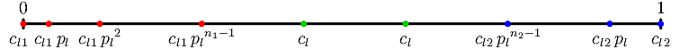

.. _1dmeshing:

1-D Meshing
===========

We consider the 1-D meshing of a unit length segment. The variables are

- :math:`c_l`: the target element size,
- :math:`{c_l}_1`: the characteristic length at vertex 1,
- :math:`{c_l}_2`: the characteristic length at vertex 2,
- :math:`p_l`: the element size progression factor.

We have the following identities:

.. math::

  \begin{equation}
  0 < {c_l}_1 \leq {c_l}\hbox{,} \qquad
  0 < {c_l}_2 \leq {c_l}\hbox{,} \qquad
  {c_l}_1 \leq {c_l}_2\hbox{,} \qquad
  {p_l} > 1
  \end{equation}

The element size is increased following a geometric progression from the
boundaries towards the body of the segment.

..
  \begin{center}
  \begin{figure}[htp]
  \begin{center}
  %
  \includegraphics{fig/1dmesh-prog.pdf}
  \caption{1-D mesh.}
  \end{center}
  \end{figure}
  \end{center}

Transition to the target characteristic length at the boundaries
----------------------------------------------------------------

When considering mesh element size progression from one extremity, the characteristic length at node :math:`i` (:math:`i=1,\dots,n`), :math:`c_l(i)`, is given by,

.. math::
  :label: cl

  \begin{equation}
  c_l (i) = {c_l}_1 \, {p_l}^{i-1}
  \end{equation}

Let :math:`x(i)` be the coordinate of point :math:`i`, :math:`c_l(x)` be the characteristic length at coordinate :math:`x`, :math:`n` be the number of nodes necessary to reach :math:`c_l/p_l` (i.e. the
value necessary to enable an element size of :math:`c_l` in the rest of the edge), and :math:`l` be the length necessary to reach :math:`c_l/p_l`.  It follows from Equation :eq:`cl` that

.. math::
  :label: x

  \begin{equation}
  x(i) = {c_l}_1 \, \frac{{p_l}^{i-1} - 1}{p_l - 1}   \qquad
  \left(\Leftrightarrow i = 1 + \lfloor\frac{\ln{\left(1 + \left(p_l-1\right) \, \frac{x}{{c_l}_1}\right)}}
               {\ln{p_l}}\rfloor \right)
  \end{equation}

.. math::
  :label: clx

  \begin{equation}
  c_l (x) = {c_l}_1 + \left(p_l-1\right) \, x
  \end{equation}

.. math::
  :label: n

  \begin{equation}
  n    = 1 + \lceil\frac{\ln\left(c_l/{c_l}_1\right)}
             {\ln{p_l}        }\rceil
  \end{equation}

.. math::
  :label: l

  \begin{equation}
  l    = {c_l}_1\,\frac{p_l^{n-1} - 1}{p_l - 1}
       \qquad \left( = \frac{c_l - {c_l}_1}{p_l - 1}\hbox{ if }n\hbox{ was real}\right)
  \end{equation}

where :math:`\lfloor\bullet\rfloor` is the largest previous integer of :math:`\bullet`.

Meshing
-------

The segment mesh is subdivided into 3 parts: the :math:`c_l`-progression parts
at both extremities and the body of the segment. The number of
nodes/elements in each parts must be determined, as well as their
coordinates.

The coordinate where the characteristic lengths progressed from the two
extremities are equal, called :math:`I`, is given by,

.. math::
  \begin{equation}
  I = \frac{1}{2} \, \left[
                   1 + \frac{p_l}{p_l - 1} \left({c_l}_2 - {c_l}_1\right)
                   \right]
  \qquad
  \left(I \geq \frac{1}{2}\right)
  \end{equation}

- :math:`I>1`: 1 segment only

  If :math:`I > 1`, :math:`{c_l}_2` cannot be reached using the progression
  factor :math:`p_l`.  A greater value must be used. It follows from
  Equation :eq:`clx` that,

  .. math::
    \begin{equation}
    {p_l}^\prime = 1 + {c_l}_2 - {c_l}_1
    \end{equation}

- :math:`I \leq 1`

  The characteristic length at :math:`I`, :math:`{c_l}_I`, can be obtained from
  Equation :eq:`cl` and is equal to,

  .. math::
    \begin{equation}
    {c_l}_I = {c_l}\left(I\right)
          = \frac{1}{2} \, \left( {c_l}_1 + {c_l}_2 + \frac{p_l - 1}{p_l} \right)
    \end{equation}

  If :math:`{c_l}_I < c_l / p_l`, then the edge will be divided into two :math:`c_l`-progression parts. 

  The number of nodes in the progression parts are

  .. math::
    \begin{equation}
    n_1 = f\left(\frac{\ln{\left({c_l}_I / {c_l}_1\right)}}
                    {\ln{\left(p_l\right)}}
        \right)
    \qquad
    n_2 = f\left( \frac{\ln{\left({c_l}_I / {c_l}_2\right)}}
                    {\ln{\left(p_l\right)}}
    \right)
    \end{equation}

  The lengths of the progression parts can be obtained from Equation :eq:`l` and are denoted :math:`l_1` and :math:`l_2`. They are such that

  .. math::
    \begin{equation}
    0 \leq \Delta l = 1 - \left(l_1 + l_2\right) \leq 2\,{c_l}_I
    \end{equation}
