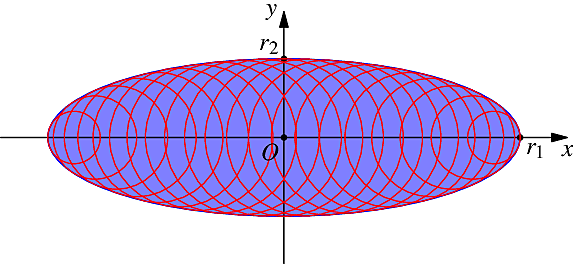

.. _1dmeshing:

Approximating an ellipse by a series of circles
===============================================

The equation of an ellipse, :math:`(E)`, of centre :math:`O` and radii :math:`x_1` along :math:`x` and :math:`r_2` along :math:`y`, is

.. math::
  :label: eq:ellipse

  \begin{equation}
    \left(\frac{x}{r_1}\right)^2
  + \left(\frac{y}{r_2}\right)^2
  = 1.
  \end{equation}

The equation of a circle, :math:`(C)`, of centre :math:`\left(x_C,\,0\right)` and radius :math:`r_C`, is

.. math::
  :label: eq:circle

  \begin{equation}
    \left(\frac{x-x_C}{r_C}\right)^2
  + \left(\frac{y}{r_C}\right)^2
  = 1.
  \end{equation}

If the ellipse and the centre of the circle are known, what is the radius of the circle that is tangent to the ellipse (:math:`r_C`)?  The intersection point is denoted as :math:`I(x_I,\,y_I)`.

We know that :math:`I` belongs to both :math:`(E)` and :math:`(C)`.  Equations :eq:`eq:ellipse` and :eq:`eq:circle` can be rewritten as

.. math::

  \begin{equation}
    y^2 = {r_2}^2 \, \left(1-\frac{x^2}{{r_1}^2}\right),
  \end{equation}

and

.. math::

  \begin{equation}
    y^2 = {r_C}^2 - \left(x - x_C\right)^2.
  \end{equation}

Thus, at :math:`I`, we have

.. math::

  \begin{equation}
    {r_2}^2 \, \left(1-\frac{x_I^2}{{r_1}^2}\right) = {r_C}^2 - \left(x_I - x_C\right)^2,
  \end{equation}

which, after elementary developments, becomes

.. math::

  \begin{equation} \label{eq:ellipse-circle-inter}
    \left(1-\frac{{r_2}^2}{{r_1}^2}\right) \, {x_I}^2 - 2 \, x_C \, x_I + \left({r_2}^2 - {r_C}^2 + {x_C}^2\right) = 0.
  \end{equation}

As :math:`(C)` is tangent to :math:`(E)`, this (2nd-order polynomial) equation must admit only 1 solution.

The discriminant must then be zero:

.. math::

  \begin{equation}
    \Delta = 4 \, {x_C}^2 -  4 \, \left(1 - \frac{{r_2}^2}{{r_1}^2} \right) \, \left({r_2}^2 - {r_C}^2 + {x_C}^2 \right) = 0,
  \end{equation}

which, after elementary developments, yields the relationship between :math:`x_C` and :math:`r_C`:

.. math::

  \begin{equation}
    {x_C}^2 = \frac{\left({r_1}^2-{r_2}^2\right)\left({r_2}^2 - {r_C}^2\right)}{{r_2}^2}.
  \end{equation}

The solution of Equation~\ref{eq:ellipse-circle-inter} yields the relationship between :math:`x_I` and :math:`x_C`:

.. math::

  \begin{equation}
    x_I = \frac{x_C}{1-{r_2}^2/{r_1}^2},
  \end{equation}

which solves the problem.  In particular, we have

- :math:`x_I=0   \Longrightarrow x_C=0`, :math:`r_C=r_2`,
- :math:`x_I=r_1 \Longrightarrow x_C = r_1 - {r_2}^2 / r_1`, :math:`r_C = {r_2}^2 / r_1`.

Here is an example:

which was generated and plotted using this code (:file:`imgs/ellipse.asy`):

.. literalinclude:: imgs/ellipse.asy
  :language: asymptote
