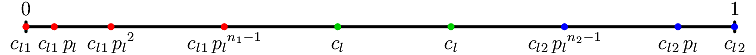
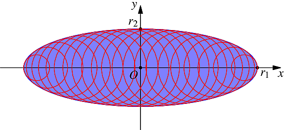

.. _science:

Results, Algorithms, etc.
=========================

.. _regularization:

Regularization: Positioning a New Vertex
----------------------------------------

Deleting a tessellation edge implies merging its two vertices into one. From the topology point of view, the resulting vertex must belong to the faces of the two original vertices.  However, in the general case, it cannot lie within the planes of all of the faces.  This results in the faces being distorted, and the new vertex is positioned so that the sum of the squares of the distances to the original planes of the faces is minimum:

.. math::

  \begin{equation}
  {D} \left(\mathbf{{x^v}}\right)
    = \sum_{i=1}^{N} \left( \mathbf{n}_i \cdot \mathbf{{x^v}} - d_i \right)^2
    \quad \hbox{minimum.}
  \end{equation}

where :math:`\mathbf{{x^v}}` is the position of the vertex, :math:`N` is the number of faces the vertex belongs to and :math:`\mathbf{n_i} \cdot \mathbf{x} -d_i = 0` is the equation of face number :math:`i`.

The faces that are at the boundary of the domain are constrained to retain in their original planes.  Therefore, a vertex can also be subjected to the constraint that it must retain on a given plane.  This can be expressed as follows:

.. math::

  \begin{equation}
  \mathbf{n}_i^\prime \cdot \mathbf{{x^v}} - d_i^\prime = 0 \quad \hbox{ for
  }i\in\left\{1,\,2,\,\dots, M\right\},
  \end{equation}

where :math:`M` is the number of domain faces the vertex must retain on and :math:`\mathbf{n_i^\prime} \cdot \mathbf{x} -d_i^\prime = 0` are the plane equations.

This is a constraint minimization problem, which can be solved using Lagrange multipliers.

We define the following function:

.. math::
  \begin{equation}
  {G} \left(\mathbf{{x^v}},\,\lambda_i\right) = {D} \left(\mathbf{{x^v}}\right) +
  \sum_{i=1}^M \lambda_i
  \left(\mathbf{n}_i^\prime \cdot \mathbf{{x^v}} - d_i^\prime\right),
  \end{equation}

which by replacing :math:`{D}\left(\mathbf{{x^v}}\right)` by its expression becomes

.. math::
  \begin{equation}
  {G} \left(\mathbf{{x^v}},\,\lambda_i\right) =
  \sum_{i=1}^{N} \left( \mathbf{n}_i \cdot \mathbf{{x^v}} - d_i \right)^2
  + \sum_{i=1}^M \lambda_i
  \left(\mathbf{n}_i^\prime \cdot \mathbf{{x^v}} - d_i^\prime\right).
  \end{equation}

The derivative of the function with respect to :math:`\mathbf{{x^v}}` and each of the :math:`\lambda_i` must be zero, which gives,

.. math::
  :label: dgdx

  \begin{equation}
  \frac{1}{2}\,\frac{\partial\, {G}\left(\mathbf{{x^v}},\,\lambda_i\right) }{\partial \, \mathbf{{x^v}}}
  = 
  \sum_{i=1}^{N} \left(\mathbf{n}_i \otimes \mathbf{n}_i\right) \cdot \mathbf{{x^v}}
  - \sum_{i=1}^{N} d_i\,\mathbf{n}_i
  + \sum_{i=1}^M \frac{\lambda_i}{2} \, \mathbf{n}_i^\prime
    = \mathbf{0}
    \quad \hbox{(3 equations)}
  \end{equation}

and

.. math::
  :label: dgdlambda

  \begin{equation}
  \frac{\partial\, {G}\left(\mathbf{{x^v}},\,\lambda_i\right) }{\partial
    \, \lambda_i}
  = 
  \mathbf{n}_i^\prime \cdot \mathbf{{x^v}} - d_i^\prime = 0
  \quad \forall \, i\in\left\{1,\,2,\,\dots, M\right\}
  \quad \hbox{($M$ equations)}
  \end{equation}

which is the expression of the original constraint (as expected).

Equations :eq:`dgdx` and :eq:`dgdlambda` form a system of :math:`3+M` equations for :math:`3+M` unknowns (3 :math:`\mathbf{{x^v}}` components and :math:`M` :math:`\lambda_i`).  The system can be written as a linear matrix system.  With :math:`\mathbf{{N}} = \sum_{i=1}^N \left(\mathbf{n}_i \otimes \mathbf{n}_i\right)`,

.. math::
  \begin{equation}
  \left[\begin{array}{cccccc}
  {N}_{11} & {N}_{12} & {N}_{13} & (n_1^\prime)_1 & \cdots & (n_M^\prime)_1  \\
  {N}_{21} & {N}_{22} & {N}_{23} & (n_1^\prime)_2 & \cdots & (n_M^\prime)_2  \\
  {N}_{31} & {N}_{32} & {N}_{33} & (n_1^\prime)_3 & \cdots & (n_M^\prime)_3  \\
    (n_1^\prime)_1 & (n_1^\prime)_2 & (n_1^\prime)_3 & 0 & \cdots & 0 \\
    \cdots & \cdots & \cdots & 0 & \cdots & 0 \\
    (n_M^\prime)_1 & (n_M^\prime)_2 & (n_M^\prime)_3 & 0 & \cdots & 0 \\
  \end{array}\right]
  \left[\begin{array}{c}
  {x^v}_1 \\
  {x^v}_2 \\
  {x^v}_3 \\
  \frac{1}{2}\,\lambda_1 \\
  \cdots \\
  \frac{1}{2}\,\lambda_M \\
  \end{array}\right]
  =
  \left[\begin{array}{c}
  \sum_{i=1}^N d_i\,(n_i)_1 \\
  \sum_{i=1}^N d_i\,(n_i)_2 \\
  \sum_{i=1}^N d_i\,(n_i)_3 \\
    d_1^\prime \\
    \cdots     \\
    d_M^\prime \\
  \end{array}\right].
  \end{equation}
.. _1dmeshing:

1-D Meshing
-----------

We consider the 1-D meshing of a unit length segment. The variables are

- :math:`c_l`: the target element size,
- :math:`{c_l}_1`: the characteristic length at vertex 1,
- :math:`{c_l}_2`: the characteristic length at vertex 2,
- :math:`p_l`: the element size progression factor.

We have the following identities:

.. math::

  \begin{equation}
  0 < {c_l}_1 \leq {c_l}\hbox{,} \qquad
  0 < {c_l}_2 \leq {c_l}\hbox{,} \qquad
  {c_l}_1 \leq {c_l}_2\hbox{,} \qquad
  {p_l} > 1
  \end{equation}

The element size is increased following a geometric progression from the
boundaries towards the body of the segment.

..
  \begin{center}
  \begin{figure}[htp]
  \begin{center}
  %
  \includegraphics{fig/1dmesh-prog.pdf}
  \caption{1-D mesh.}
  \end{center}
  \end{figure}
  \end{center}

Transition to the target characteristic length at the boundaries
~~~~~~~~~~~~~~~~~~~~~~~~~~~~~~~~~~~~~~~~~~~~~~~~~~~~~~~~~~~~~~~~

When considering mesh element size progression from one extremity, the characteristic length at node :math:`i` (:math:`i=1,\dots,n`), :math:`c_l(i)`, is given by,

.. math::
  :label: cl

  \begin{equation}
  c_l (i) = {c_l}_1 \, {p_l}^{i-1}
  \end{equation}

Let :math:`x(i)` be the coordinate of point :math:`i`, :math:`c_l(x)` be the characteristic length at coordinate :math:`x`, :math:`n` be the number of nodes necessary to reach :math:`c_l/p_l` (i.e. the
value necessary to enable an element size of :math:`c_l` in the rest of the edge), and :math:`l` be the length necessary to reach :math:`c_l/p_l`.  It follows from Equation :eq:`cl` that

.. math::
  :label: x

  \begin{equation}
  x(i) = {c_l}_1 \, \frac{{p_l}^{i-1} - 1}{p_l - 1}   \qquad
  \left(\Leftrightarrow i = 1 + \lfloor\frac{\ln{\left(1 + \left(p_l-1\right) \, \frac{x}{{c_l}_1}\right)}}
               {\ln{p_l}}\rfloor \right)
  \end{equation}

.. math::
  :label: clx

  \begin{equation}
  c_l (x) = {c_l}_1 + \left(p_l-1\right) \, x
  \end{equation}

.. math::
  :label: n

  \begin{equation}
  n    = 1 + \lceil\frac{\ln\left(c_l/{c_l}_1\right)}
             {\ln{p_l}        }\rceil
  \end{equation}

.. math::
  :label: l

  \begin{equation}
  l    = {c_l}_1\,\frac{p_l^{n-1} - 1}{p_l - 1}
       \qquad \left( = \frac{c_l - {c_l}_1}{p_l - 1}\hbox{ if }n\hbox{ was real}\right)
  \end{equation}

where :math:`\lfloor\bullet\rfloor` is the largest previous integer of :math:`\bullet`.

Meshing
~~~~~~~

The segment mesh is subdivided into 3 parts: the :math:`c_l`-progression parts
at both extremities and the body of the segment. The number of
nodes/elements in each parts must be determined, as well as their
coordinates.

The coordinate where the characteristic lengths progressed from the two
extremities are equal, called :math:`I`, is given by,

.. math::
  \begin{equation}
  I = \frac{1}{2} \, \left[
                   1 + \frac{p_l}{p_l - 1} \left({c_l}_2 - {c_l}_1\right)
                   \right]
  \qquad
  \left(I \geq \frac{1}{2}\right)
  \end{equation}

- :math:`I>1`: 1 segment only

  If :math:`I > 1`, :math:`{c_l}_2` cannot be reached using the progression
  factor :math:`p_l`.  A greater value must be used. It follows from
  Equation :eq:`clx` that,

  .. math::
    \begin{equation}
    {p_l}^\prime = 1 + {c_l}_2 - {c_l}_1
    \end{equation}

- :math:`I \leq 1`

  The characteristic length at :math:`I`, :math:`{c_l}_I`, can be obtained from
  Equation :eq:`cl` and is equal to,

  .. math::
    \begin{equation}
    {c_l}_I = {c_l}\left(I\right)
          = \frac{1}{2} \, \left( {c_l}_1 + {c_l}_2 + \frac{p_l - 1}{p_l} \right)
    \end{equation}

  If :math:`{c_l}_I < c_l / p_l`, then the edge will be divided into two :math:`c_l`-progression parts. 

  The number of nodes in the progression parts are

  .. math::
    \begin{equation}
    n_1 = f\left(\frac{\ln{\left({c_l}_I / {c_l}_1\right)}}
                    {\ln{\left(p_l\right)}}
        \right)
    \qquad
    n_2 = f\left( \frac{\ln{\left({c_l}_I / {c_l}_2\right)}}
                    {\ln{\left(p_l\right)}}
    \right)
    \end{equation}

  The lengths of the progression parts can be obtained from Equation :eq:`l` and are denoted :math:`l_1` and :math:`l_2`. They are such that

  .. math::
    \begin{equation}
    0 \leq \Delta l = 1 - \left(l_1 + l_2\right) \leq 2\,{c_l}_I
    \end{equation}
.. _smoothing:

Constrained Laplacian Smoothing
-------------------------------

The usual Laplacian smoothing algorithm is an iterative algorithm which consists in moving each node depending on the position of its neighbors. This can be expressed as

.. math::

  \begin{equation}
  \mathbf{x}^{a+1} = (1 - A) \, \mathbf{x}^{a} + A \, \mathbf{x_n}^{a},
  \end{equation}

where :math:`\mathbf{x}^{a+1}` is the position of the node at iteration :math:`a+1` (accordingly, :math:`\mathbf{x}^{a}` is the position of the node at iteration :math:`a`), :math:`\mathbf{x_n}^{a}` is a position depending on the neighbors (at iteration :math:`a`) and :math:`A` is a weighting factor.

In standard Laplacian algorithm, :math:`\mathbf{x_n}^{a}` is taken as the barycenter of the neighbors:

.. math::
  :label: eqn:xnabary

  \begin{equation}
    \mathbf{x_n}^{a} = \frac{\sum_{i=1}^N {\alpha_i}^a\,\mathbf{x_i}^{a}}
                          {\sum_{i=1}^N {\alpha_i}^a},
  \end{equation}

where :math:`{\alpha_i}^{a}` and :math:`\mathbf{x_i}^{a}` are the weight and position of neighbor :math:`i` of the node submitted to smoothing (position :math:`\mathbf{x}^{a}`). :math:`{\alpha_i}^{a}` can be defined as the inverse of the distance between :math:`\mathbf{x_i}^a` and :math:`\mathbf{x}^a`.

In our case, however, a node which is on the domain boundary must be constrained to retain within the faces it belongs to.  :math:`\mathbf{x}^{a}` satisfies the constraints and :math:`\mathbf{x}^{a+1}` must do too.  This is ensured by reporting the constraints on :math:`\mathbf{x_n}^{a}`.  Its definition (Equation :eq:`eqn:xnabary`) must be changed to accept constraints, which can typically be done by turning to minimization.

Equation :eq:`eqn:xnabary` can be rewritten as

.. math::
  :label: eqn:xnabaryrw

  \begin{equation}
    \sum_{i=1}^N {\alpha_i}^a\,\left(\mathbf{x_i}^{a} - \mathbf{x_n}^{a}\right) = \mathbf{0}.
  \end{equation}

To allow for constraints, we can turn Equation :eq:`eqn:xnabaryrw` into,

.. math::
  :label: eqn:xnabaryrw2

  \begin{equation}
    \left|\sum_{i=1}^N {\alpha_i}^a\,\left(\mathbf{x_i}^{a} - \mathbf{x_n}^{a}\right)\right| \quad \hbox{minimum.}
  \end{equation}

Such an expression is not well suited to (analytic) minimization.  We can instead consider a quadratic expression, as follows:

.. math::
  :label: eqn:xnabaryrw2

  \begin{equation}
    \mathcal{D}\left(\mathbf{x_n}^a\right)
    = \sum_{i=1}^N {\alpha_i}^a\,\left(\mathbf{x_i}^{a} - \mathbf{x_n}^{a}\right)^2 \quad \hbox{minimum}.
  \end{equation}

:math:`\mathbf{x_n}^a` must be constrained to retain in the planes of the domain faces the node submitted to smoothing belongs to.  This can be expressed as

.. math::

  \begin{equation}
  \mathbf{n}_i^\prime \cdot \mathbf{{x_n}}^a - d_i^\prime = 0 \quad \hbox{ for
  }i\in\left\{1,\,2,\,\dots, N\right\},
  \end{equation}

where :math:`N` is the number of domain faces and :math:`\mathbf{n_i^\prime} \cdot \mathbf{x} -d_i^\prime = 0` are the plane equations.

This is a constraint minimization problem, which can be solved using Lagrange multipliers.

We define the following function:

.. math::

  \begin{equation}
  \mathcal{G} \left(\mathbf{{x_n}}^a,\,\lambda_i\right) = \mathcal{D}
  \left(\mathbf{{x_n}}^a\right) +
  \sum_{i=1}^N \lambda_i
  \left(\mathbf{n}_i^\prime \cdot \mathbf{{x_n}}^a - d_i^\prime\right),
  \end{equation}

which by replacing :math:`\mathcal{D}\left(\mathbf{{x_n}}^a\right)` by its expression becomes

.. math::

  \begin{equation}
  \mathcal{G} \left(\mathbf{{x_n}}^a,\,\lambda_i\right) =
  \sum_{i=1}^N {\alpha_i}^a\,\left(\mathbf{x_i}^{a} - \mathbf{x_n}^{a}\right)^2
  + \sum_{i=1}^M \lambda_i
  \left(\mathbf{n}_i^\prime \cdot \mathbf{{x_n}}^a - d_i^\prime\right).
  \end{equation}

The derivative of the function with respect to :math:`\mathbf{{x_n}}^a` and each of the :math:`\lambda_i` must be zero, which gives

.. math::
  :label: eq:dgdx

  \begin{equation}
  \frac{\partial\, \mathcal{G}\left(\mathbf{{x_n}}^a,\,\lambda_i\right)
  }{\partial \, \mathbf{{x_n}}^a}
  = 
  -2\,\sum_{i=1}^{N} {\alpha_i}^a\,\left(\mathbf{x_i}^a - \mathbf{x_n}^a \right) 
  + \sum_{i=1}^M \lambda_i \, \mathbf{n}_i^\prime
    = \mathbf{0}
    \quad \hbox{(3 equations)},
  \end{equation}

and

.. math::
  :label: eq:dgdlambda

  \begin{equation}
  \frac{\partial\, \mathcal{G}\left(\mathbf{{x_n}}^a,\,\lambda_i\right) }{\partial
    \, \lambda_i}
  = 
  \mathbf{n}_i^\prime \cdot \mathbf{{x_n}}^a - d_i^\prime = 0
  \quad \forall \, i\in\left\{1,\,2,\,\dots, M\right\}
  \quad \hbox{($M$ equations)},
  \end{equation}

which is the expression of the original constraint (as expected).

Equations :eq:`eq:dgdx` and :eq:`eq:dgdlambda` form a system of :math:`3+M` equations for :math:`3+M` unknowns (3 :math:`\mathbf{{x_n}}^a` components and :math:`M` :math:`\lambda_i`).  The system can be written as a linear matrix system:

.. math::

  \begin{equation}
  \left[\begin{array}{cccccc}
  \sum_{i=1}^N {\alpha_i}^a & 0 & 0 & (n_1^\prime)_1 & \cdots & (n_M^\prime)_1  \\
  0 & \sum_{i=1}^N {\alpha_i}^a & 0 & (n_1^\prime)_2 & \cdots & (n_M^\prime)_2  \\
  0 & 0 & \sum_{i=1}^N {\alpha_i}^a & (n_1^\prime)_3 & \cdots & (n_M^\prime)_3  \\
    (n_1^\prime)_1 & (n_1^\prime)_2 & (n_1^\prime)_3 & 0 & \cdots & 0 \\
    \cdots & \cdots & \cdots & 0 & \cdots & 0 \\
    (n_M^\prime)_1 & (n_M^\prime)_2 & (n_M^\prime)_3 & 0 & \cdots & 0 \\
  \end{array}\right]
  \left[\begin{array}{c}
  \left({x_n}^a\right)_1 \\
  \left({x_n}^a\right)_2 \\
  \left({x_n}^a\right)_3 \\
  \frac{1}{2}\,\lambda_1 \\
  \cdots \\
  \frac{1}{2}\,\lambda_M \\
  \end{array}\right]
  =
  \left[\begin{array}{c}
  \sum_{i=1}^N {\alpha_i}^a\,({x_i}^a)_1 \\
  \sum_{i=1}^N {\alpha_i}^a\,({x_i}^a)_2 \\
  \sum_{i=1}^N {\alpha_i}^a\,({x_i}^a)_3 \\
    d_1^\prime \\
    \cdots     \\
    d_M^\prime \\
  \end{array}\right].
  \end{equation}

If several domain faces have the same equation, the corresponding constraint must be taken into account as one equation only to avoid the above matrix to be singular.

.. _1dmeshing:

1-D Laguerre Tessellation
-------------------------

A Voronoi tessellation use an Euclidean distance, which in 1D is

.. math::

  \begin{equation}
  {d_E(p_i,\,q)}^2 = (p_i - q)^2.
  \end{equation}

In Laguerre geometry, the distance is

.. math::

  \begin{equation}
  {d_L(p_i,\,q)}^2 = {d_E(p_i,\,q)}^2 - w_i.
  \end{equation}

The interface between two points :math:`p_i` and :math:`p_j`, of coordinate :math:`q`, is such
that

.. math::

  \begin{equation}
  {d_L(p_i,\,q)}^2 = {d_L(p_j,\,q)}^2,
  \end{equation}

which can be rewritten as

.. math::

  \begin{equation}
  {d_E(p_i,\,q)}^2 - w_i = {d_E(p_j,\,q)}^2 - w_j,
  \end{equation}

and so

.. math::

  \begin{equation}
  {(p_i - q)}^2 - w_i = {(p_j - q)}^2 - w_j,
  \end{equation}

.. math::

  \begin{equation}
  {p_i}^2 - 2\,p_i\,q + q^2 - w_i
  = {p_j}^2 - 2\,p_j\,q + q^2 - w_j,
  \end{equation}

.. math::

  \begin{equation}
  -2\,(p_i-p_j)\,q
  =   w_i - w_j
   - ({p_i}^2 - {p_j}^2),
  \end{equation}

.. math::

  \begin{equation}
  q
  = \frac{1}{2}\,(p_i + p_j)
  - \frac{1}{2}\,\frac{w_i - w_j}
        {p_i-p_j}.
  \end{equation}

It follows that

.. math::

  \begin{equation}
  q - p_i
  = \frac{1}{2}\,(p_j - p_i)
  - \frac{1}{2}\,\frac{w_i - w_j}
        {p_i-p_j},
  \end{equation}

or

.. math::

  \begin{equation}
  q - p_i
  = \frac{1}{2}\,(p_j - p_i)
  - \frac{1}{2}\,\frac{w_j - w_i}
        {p_j-p_i}.
  \end{equation}

.. _1dmeshing:

Approximating an ellipse by a series of circles
-----------------------------------------------

The equation of an ellipse, :math:`(E)`, of centre :math:`O` and radii :math:`x_1` along :math:`x` and :math:`r_2` along :math:`y`, is

.. math::
  :label: eq:ellipse

  \begin{equation}
    \left(\frac{x}{r_1}\right)^2
  + \left(\frac{y}{r_2}\right)^2
  = 1.
  \end{equation}

The equation of a circle, :math:`(C)`, of centre :math:`\left(x_C,\,0\right)` and radius :math:`r_C`, is

.. math::
  :label: eq:circle

  \begin{equation}
    \left(\frac{x-x_C}{r_C}\right)^2
  + \left(\frac{y}{r_C}\right)^2
  = 1.
  \end{equation}

If the ellipse and the centre of the circle are known, what is the radius of the circle that is tangent to the ellipse (:math:`r_C`)?  The intersection point is denoted as :math:`I(x_I,\,y_I)`.

We know that :math:`I` belongs to both :math:`(E)` and :math:`(C)`.  Equations :eq:`eq:ellipse` and :eq:`eq:circle` can be rewritten as

.. math::

  \begin{equation}
    y^2 = {r_2}^2 \, \left(1-\frac{x^2}{{r_1}^2}\right),
  \end{equation}

and

.. math::

  \begin{equation}
    y^2 = {r_C}^2 - \left(x - x_C\right)^2.
  \end{equation}

Thus, at :math:`I`, we have

.. math::

  \begin{equation}
    {r_2}^2 \, \left(1-\frac{x_I^2}{{r_1}^2}\right) = {r_C}^2 - \left(x_I - x_C\right)^2,
  \end{equation}

which, after elementary developments, becomes

.. math::

  \begin{equation} \label{eq:ellipse-circle-inter}
    \left(1-\frac{{r_2}^2}{{r_1}^2}\right) \, {x_I}^2 - 2 \, x_C \, x_I + \left({r_2}^2 - {r_C}^2 + {x_C}^2\right) = 0.
  \end{equation}

As :math:`(C)` is tangent to :math:`(E)`, this (2nd-order polynomial) equation must admit only 1 solution.

The discriminant must then be zero:

.. math::

  \begin{equation}
    \Delta = 4 \, {x_C}^2 -  4 \, \left(1 - \frac{{r_2}^2}{{r_1}^2} \right) \, \left({r_2}^2 - {r_C}^2 + {x_C}^2 \right) = 0,
  \end{equation}

which, after elementary developments, yields the relationship between :math:`x_C` and :math:`r_C`:

.. math::

  \begin{equation}
    {x_C}^2 = \frac{\left({r_1}^2-{r_2}^2\right)\left({r_2}^2 - {r_C}^2\right)}{{r_2}^2}.
  \end{equation}

The solution of Equation~\ref{eq:ellipse-circle-inter} yields the relationship between :math:`x_I` and :math:`x_C`:

.. math::

  \begin{equation}
    x_I = \frac{x_C}{1-{r_2}^2/{r_1}^2},
  \end{equation}

which solves the problem.  In particular, we have

- :math:`x_I=0   \Longrightarrow x_C=0`, :math:`r_C=r_2`,
- :math:`x_I=r_1 \Longrightarrow x_C = r_1 - {r_2}^2 / r_1`, :math:`r_C = {r_2}^2 / r_1`.

Here is an example:

which was generated and plotted using this code (:file:`imgs/ellipse.asy`):

.. literalinclude:: imgs/ellipse.asy
  :language: asymptote

.. _odfsampling:

Random sampling of ODFs
-----------------------

Given an ODF defined on a mesh, either on elements (piecewise constant) or on nodes (piecewise linear), how can we sample it randomly?

Case of a uniform ODF
~~~~~~~~~~~~~~~~~~~~~

If the ODF is uniform (no texture), then we can choose the orientations without taking it into account, from random numbers (:math:`n_1`, :math:`n_2`, :math:`n_3`, :math:`n_4 \in [0,\,1]`):

- Euler-Bunge angles: :math:`\varphi_1=2\,\pi\,n_1`, :math:`\varphi_2= \hbox{acos} (2\,n_2-1)`, :math:`\varphi_3=2\,\pi\,n_3`
- unit quaternion: if :math:`{{n_1}^2+{n_2}^2+{n_3}^2+{n_4}^2} \leq 1` then accept orientation :math:`q_i=n_i`
- homochoric vector:  if :math:`\sqrt{{n_1}^2+{n_2}^2+{n_3}^2} \leq 1` then accept orientation :math:`x_i=n_i`

Case of a non-uniform ODF
~~~~~~~~~~~~~~~~~~~~~~~~~

.. note::

  Reminder on the expressions of the volume element, :math:`dg`:

  1. Rodrigues space:

    - :math:`dg = \left(\frac{\rho}{1+\rho^2}\right)^2 \, d\rho \sin{\chi} \, d\chi \, d\zeta` (polar coordinates)
    - :math:`dg = \left(\frac{1}{1+\rho^2}\right)^2 \, dr_1 \, dr_2 \, dr_3` (rectangular coordinates)

    - By definition, :math:`\int_g dg = \pi^2` (with :math:`\rho\in\left[0,\,+\infty\right[`, :math:`\chi\in\left[0,\,\pi\right]` and :math:`\zeta\in\left[0,\,2\,\pi\right]` or :math:`\left\{r_1,\, r_2,\, r_3\right\} \in \mathbb{R}^3`).  If integration is done on a fundamental region, then the integral is equal to :math:`\pi^2/n_c`, where :math:`n_c` is the multiplicity (24 for cubic, etc.).

  2. Euler space (Bunge convention):

    - :math:`dg = \sin{\phi} \, d\varphi_1 \, d\phi \, d\varphi_2`

    - By definition, :math:`\int_{\varphi_1=0}^{2\,\pi}  \int_{\phi=0}^{\pi/2} \int_{\varphi_2=0}^{\pi/2} dg = \pi^2`

    - :math:`\sqrt{\hbox{det}(g)} = \frac{1}{8\,\pi^2} \sin{\phi}`, where :math:`g` is the metric tensor

  3. Homochoric space:

 The integral of the ODF, :math:`f(g)`, over full orientation space is therefore equal to :math:`\pi^2`.  The integral over the cubic fundamental region is equal to :math:`\pi^2/24`.

If the ODF is non-uniform, the frequency of orientations must adhere to the intensity of the ODF (by definition).  One may distinguish random sampling and uniform sampling, however.  Uniform sampling (just as we implemented it for the case of a uniform ODF) attempts to fit the ODF at best given the number of orientations available.  Random sampling (just as we apply it to the case of a uniform ODF) follows the ODF from a statistical point of view, but does not attempt to fit it at best; it retains a random character.  This is the case developed here.

Let the ODF be defined as

.. math::

  \begin{equation}
    f(\boldsymbol{x}) = \frac{1}{V} \, \frac{dV(\boldsymbol{x})}{d\boldsymbol{x}},
  \end{equation}

where :math:`\boldsymbol{x}` is the orientation.

Rejection sampling (inefficient)
^^^^^^^^^^^^^^^^^^^^^^^^^^^^^^^^

Let :math:`f_\text{max}` be the maximum of :math:`f`.  The procedure is then the following:

  1. Pick a random orientation, :math:`\boldsymbol{x}`, following a uniform ODF;
  2. Generate a random number :math:`t\in[0,\,1]`;
  3. if :math:`t < f(\boldsymbol{x}) / f_\text{max}`, then accept orientation.

Terminate when all orientations have been generated.

The efficiency of the method scales with :math:`1/f_\text{max}`; that is, the stronger the texture is, the more orientations need to be generated and tested to attain the desired number of orientations.  One may also note that the evaluation of :math:`f` at a particular orientation may be costly (for large meshes), which makes the process relatively inefficient.

Inverse transform sampling (100% efficient)
^^^^^^^^^^^^^^^^^^^^^^^^^^^^^^^^^^^^^^^^^^^

.. note:: This is the method implemented in Neper.

The ODF is defined over (multidimensional) orientation space; however, the discretization of orientation space (its mesh elements) provides a unidimensional ODF function that depends on the orientations (the numbers of the mesh elements), :math:`f_u (x)`, where :math:`x` is an integer than varies from 1 to :math:`N` (the total number of elemental orientations).  (Note that the respective positions if the elements have no influence.) The "frequency of occurrence" of an orientation represented by element :math:`x`, which can be seen as a *probability*, :math:`p_x`, is given by:

.. math::

   \begin{equation}
     p_x = \frac{n_c}{\pi^2} \, v_x \, f_u(x)
   \end{equation}

where :math:`v_x` is the volume of orientation space that orientation :math:`x` represents (taking into account the orientation multiplicity), and :math:`f_u(x)` its ODF value, and :math:`n_c` is the multiplicity of the space (24 for cubic).

:math:`v_x` is computed by integration of :math:`dg` over the associated element.  In practice, it is taken as the volume of the element multiplied by :math:`(1 / (1 + \rho^2))^2`, in Rodrigues space (:math:`\rho = \sqrt{{r_1}^2 + {r_2}^2 + {r_3}^2}` assumed constant). So, :math:`p_x` sums to 1.

Formally, the inverse transform sampling is based on the fact that, for any random variable :math:`X \in \mathbb{R}`, the random variable :math:`F_X^{-1}(U)` has the same probability density function as :math:`X`, where :math:`F_X^{-1}` is the generalized inverse of the cumulative distribution function :math:`F_X` of :math:`X` and :math:`U` is uniform on :math:`[0,\,1]`.

In the present case, discrete (random) variables are discussed. The cumulative distribution function can be expressed as

.. math::

   \begin{equation}
     P(x) = \sum_{j\leq x} p_j
   \end{equation}

which is a step function.  As a step function does not have an inverse, the concept of generalized inverse is of particular importance.

The generalized inverse of :math:`P` is:

.. math::

   \begin{equation}
     P^-(y) = \hbox{inf}\left\{x \in \mathbb{R} : P(x) \geq y\right\}, y \in \mathbb{R}
   \end{equation}

Note that entire ranges of values of :math:`y` now correspond to a single value of :math:`x`.

The procedure then is to draw a random number between 0 and 1, :math:`y`, and compute the value of :math:`P^-(y)`.  This value is the element from which we generate an orientation.

To complete the process, for any selected element, :math:`y`, the orientation is chosen randomly within the element.  To do so, we pick a random position inside the element, following a uniform space distribution, using Rocchini and Cignoni's method (https://doi.org/10.1080/10867651.2000.10487528), which provides the orientation.

This method is direct and does not involve any testing or rejection.  It is *almost* correct in the sense that steps 1 and 2 are correct, but step 3 assumes a uniform density of the space inside an element.  This is reasonable assumption for properly conditioned spaces (such as Rodrigues space) and properly refined meshes, and is the same assumption as the one made to discretize the ODF itself.

Useful references:
  - https://link.springer.com/article/10.1007/s00186-013-0436-7
  - Morawiec's book for the rejection method
  - L13-Grain_Bndries_RFspace-15Mar16.pdf for the volume element
  - find a book in statistics for rejection and inverse sampling methods, which are standard

Description of orientation sets, distributions, etc.
----------------------------------------------------

There are several :code:`struct` related to orientations.

- In Orilib, :code:`struct OL_SET` describes a *discrete orientation set*:

.. code:: C

  struct OL_SET
  {
    char* crysym;          // crystal symmetry (cubic, hexagonal, etc.)
    size_t nc;             // orientation multiplicity (24 for cubic, etc.)

    // all arrays are 0-indexed
    size_t size;           // number of orientations
    double **q;            // orientations as quaternions
    double *weight;        // weights (if != NULL)
    double *theta;         // angular spread (std. dev. of the normal distribution, in degrees)
    double **theta3;       // anisotropic angular spread (3 values)
    int* id;               // indexed or not? (0/1)
  };

- In :code:`neut/`, :code:`struct OSPACE` describes an *orientation space* and its *fundamental region*:

.. code:: C

  struct OSPACE
  {
    // Space

    char *space;           // rodrigues or homochoric or euler-bunge
    char *spaceunit;       // radian or degree, for space=euler

    // Crystal symmetry

    char* crysym;          // crystal symmetry (cubic, hexagonal, etc.)

    // Fundamental region (FR): name and description

    char *fr;              // built-in FR name, default "fr20"

    struct TESS Tess;      // FR's tessellation
    struct NODES Nodes;    // FR's nodes
    struct MESH *Mesh;     // FR's meshes
    void *pqcloud;         // pointer to the nanoflann cloud (elemental orientations)
    void *pqtree;          // pointer to the nanoflann tree (elemental orientations)
    void *pqcloudn;        // pointer to the nanoflann cloud (nodal orientations)
    void *pqtreen;         // pointer to the nanoflann tree (nodal orientations)

    struct FCT hfct;
    struct FCT thetafct;
  };

- In :code:`neut/`, :code:`struct ODF` describes an *orientation distribution function*:

.. code:: C

  struct ODF
  {
    struct OSPACE Sp;         // orientation space

    double sigma;            // standard deviation of the kernel (in radian)

    // All arrays are 0-indexed
    int odfqty;              // number of elemental values (= Sp.Mesh[3].EltQty)
    double *odf;             // elemental values
    int odfnqty;             // number of nodal values (= Sp.Nodes.NodeQty)
    double *odfn;            // nodal values

    double odfmin;           // minimum elemental value
    double odfmax;           // maximum elemental value
    double odfmean;          // mean    elemental value
    double odfsig;           // standard deviation
  };

- In :code:`neut/`, :code:`struct ORI` is used only by :code:`neper_v`, for printing:

.. code:: C

  struct ORI
  {
    char *space;            // space (rodrigues or euler)
    char *crysym;           // crystal symmetry

    char *mode;             // density or symbol (or combination)
    char *layout;           // layout (default surface,slices)
    char *field;            // field to print(?)

    // For tracking

    int inputqty;           // number of inputs
    char **inputs;          // inputs

    struct OSPACE Sp;       // orientation space

    struct SIM *pSim;       // pointer to SIM structure
  };
