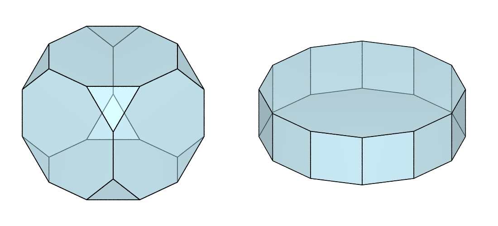
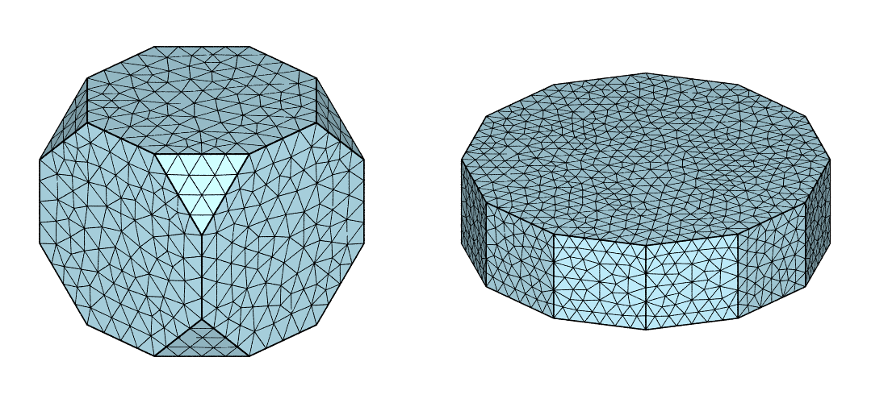
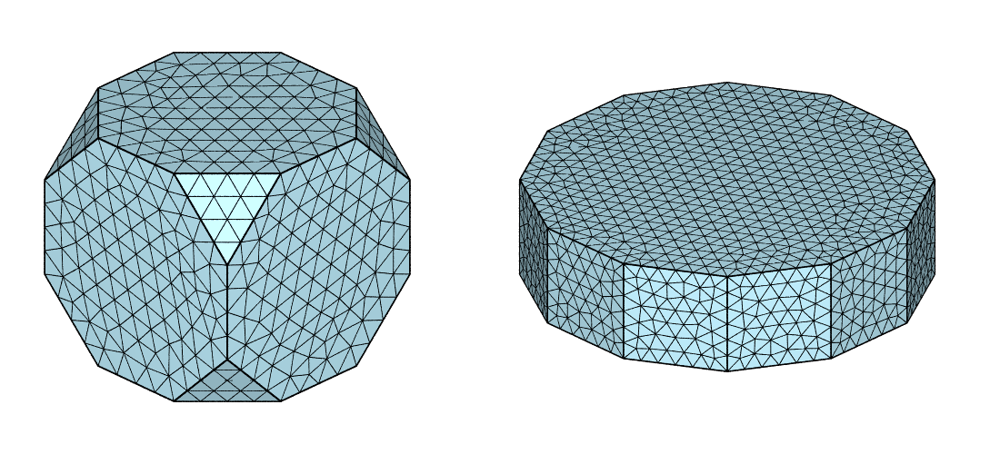

.. _orientation_space:

Generating and Meshing a Fundamental Region of Orientation Space
================================================================

.. important:: Read first: :ref:`simple_model`.

Fundamental regions of Rodrigues orientation space can be generated as tessellation *domains*, using :option:`-domain`, for any crystal symmetry (cubic, hexagonal, etc.).
Once defined as a domain, a fundamental region can be tessellated and meshed just as any other domain.
A mesh of the fundamental region is necessary, for example, in the :ref:`neper_s`, to define the orientation space (:option:`-orispace`).
Due to the particularity of the fundamental region of orientation space, it is also possible to enforce *periodicity* relationships between equivalent faces, i.e. faces that represent equivalent orientations, even if the domain does not have a periodic shape (the same goes for equivalent edges and vertices).

Generating and Meshing a Standard Fundamental Region
----------------------------------------------------

A fundamental region can simply be generated using :option:`-domain`, by specifying the crystal symmetry.  For example, for *cubic* and *hexagonal* crystal symmetries:

.. code-block:: console

  $ neper -T -n 1 -domain "rodrigues(cubic)" -o fr-cub
  $ neper -T -n 1 -domain "rodrigues(hexagonal)" -o fr-hex

A fundamental region is best visualized in nearly-isometric, orthographic projection.  We can also adjust the cell and edge properties for better rendering:

.. code-block:: console

  $ neper -V fr-cub.tess -datacellcol lightblue -datacelltrs 0.5 -dataedgerad 0.003 -cameracoo 4:4:3 -cameraprojection orthographic -imagesize 500:500 -cameraangle 13 -print fr-cub
  $ neper -V fr-hex.tess -datacellcol lightblue -datacelltrs 0.5 -dataedgerad 0.004 -cameracoo 4:4:3 -cameraprojection orthographic -imagesize 600:500 -cameraangle 24 -print fr-hex
  $ convert +append fr-cub.png fr-hex.png fr1.png

An internal tessellation can be generated as for any other domain.  For example, to generate a simple 100-cell tessellation:

.. code-block:: console

  $ neper -T -n 100 -domain "rodrigues(cubic)" -o fr-cub100
  $ neper -T -n 100 -domain "rodrigues(hexagonal)" -o fr-hex100

Again, we adjust the cell and edge properties for better rendering:

.. code-block:: console

  $ neper -V fr-cub100.tess -datacelltrs 0.5 -dataedgerad "((domtype==1)?0.003:0.002)" -cameracoo 4:4:3 -cameraprojection orthographic -imagesize 500:500 -cameraangle 13 -print fr-cub100
  $ neper -V fr-hex100.tess -datacelltrs 0.5 -dataedgerad "((domtype==1)?0.004:0.003)" -cameracoo 4:4:3 -cameraprojection orthographic -imagesize 600:500 -cameraangle 24 -print fr-hex100
  $ convert +append fr-cub100.png fr-hex100.png fr3.png

.. image:: orientation_space/fr3.png

The generated tessellations (either 1-cell or 100-cell) can be meshed.  For example, with 1 cell (untessellated fundamental regions):

.. code-block:: console

  $ neper -M fr-cub.tess -cl 0.1
  $ neper -M fr-hex.tess -cl 0.1

  $ neper -V fr-cub.tess,fr-cub.msh -dataelsetcol lightblue -showelt1d all -dataelt1drad 0.003 -dataelt3dedgerad 0.0015 -cameracoo 4:4:3 -cameraprojection orthographic -imagesize 500:500 -cameraangle 13 -print fr-cub
  $ neper -V fr-hex.tess,fr-hex.msh -dataelsetcol lightblue -showelt1d all -dataelt1drad 0.004 -dataelt3dedgerad 0.0022 -cameracoo 4:4:3 -cameraprojection orthographic -imagesize 600:500 -cameraangle 24 -print fr-hex
  $ convert +append fr-cub.png fr-hex.png fr4.png

Optionally, the frontal 2D meshing algorithm can be enforced to generate a more regular surface mesh:

.. code-block:: console

  $ neper -M fr-cub.tess -cl 0.1 -mesh2dalgo fron
  $ neper -M fr-hex.tess -cl 0.1 -mesh2dalgo fron

  $ neper -V fr-cub.tess,fr-cub.msh -dataelsetcol lightblue -showelt1d all -dataelt1drad 0.003 -dataelt3dedgerad 0.0015 -cameracoo 4:4:3 -cameraprojection orthographic -imagesize 500:500 -cameraangle 13 -print fr-cub
  $ neper -V fr-hex.tess,fr-hex.msh -dataelsetcol lightblue -showelt1d all -dataelt1drad 0.004 -dataelt3dedgerad 0.0022 -cameracoo 4:4:3 -cameraprojection orthographic -imagesize 600:500 -cameraangle 24 -print fr-hex
  $ convert +append fr-cub.png fr-hex.png fr5.png

.. image:: orientation_space/fr5.png

.. note:: Such meshes can be used in :option:`-orispace`, in the :ref:`neper_s`.

Generating and Meshing a Periodic Fundamental Region
----------------------------------------------------

.. note:: This is available only for 1-cell tessellations (:option:`-n`:data:`1`).

Periodicity can be enforced using :option:`-periodicity`:data:`1` (:data:`-per 1` for short):

.. code-block:: console

  $ neper -T -n 1 -domain "rodrigues(cubic)" -per 1 -o fr-cub
  $ neper -T -n 1 -domain "rodrigues(hexagonal)" -per 1 -o fr-hex

which visually does not change anything at all:

.. code-block:: console

  $ neper -V fr-cub.tess -datacellcol lightblue -datacelltrs 0.5 -dataedgerad 0.003 -cameracoo 4:4:3 -cameraprojection orthographic -imagesize 500:500 -cameraangle 13 -print fr-cub
  $ neper -V fr-hex.tess -datacellcol lightblue -datacelltrs 0.5 -dataedgerad 0.004 -cameracoo 4:4:3 -cameraprojection orthographic -imagesize 600:500 -cameraangle 24 -print fr-hex
  $ convert +append fr-cub.png fr-hex.png fr6.png

.. image:: orientation_space/fr6.png

However, this defines periodicity relationships for the vertices, edges and faces in the :ref:`tess_file`.

The generated tessellations can be meshed:

.. code-block:: console

  $ neper -M fr-cub.tess -cl 0.1 -mesh2dalgo fron
  $ neper -M fr-hex.tess -cl 0.1 -mesh2dalgo fron

  $ neper -V fr-cub.tess,fr-cub.msh -dataelsetcol lightblue -showelt1d all -dataelt1drad 0.003 -dataelt3dedgerad 0.0015 -cameracoo 4:4:3 -cameraprojection orthographic -imagesize 500:500 -cameraangle 13 -print fr-cub
  $ neper -V fr-hex.tess,fr-hex.msh -dataelsetcol lightblue -showelt1d all -dataelt1drad 0.004 -dataelt3dedgerad 0.0022 -cameracoo 4:4:3 -cameraprojection orthographic -imagesize 600:500 -cameraangle 24 -print fr-hex
  $ convert +append fr-cub.png fr-hex.png fr7.png

The meshes of the opposite faces, which can be visualized as follows, are such that their nodes follow the orientation equivalency [#orientation_equivalency]_:

.. code-block:: console

  $ neper -V fr-cub.tess,fr-cub.msh -showelt3d none -showelt2d "elset2d<=2" -dataelt2dcol lightblue -showelt1d all -dataelt1drad 0.003 -dataelt2dedgerad 0.0015 -cameracoo 4:4:3 -cameraprojection orthographic -imagesize 500:500 -cameraangle 13 -print fr-cub
  $ neper -V fr-hex.tess,fr-hex.msh -showelt3d none -showelt2d "elset2d==9||elset2d==10" -dataelt2dcol lightblue -showelt1d all -dataelt1drad 0.004 -dataelt2dedgerad 0.0022 -cameracoo 4:4:3 -cameraprojection orthographic -imagesize 600:500 -cameraangle 24 -print fr-hex
  $ convert +append fr-cub.png fr-hex.png fr8.png

.. image:: orientation_space/fr8.png

.. [#orientation_equivalency] Orientation equivalency between opposite faces is not equivalent to simple translation or symmetry, see (Kumar and Dawson, CMAME, 1998) for details.
