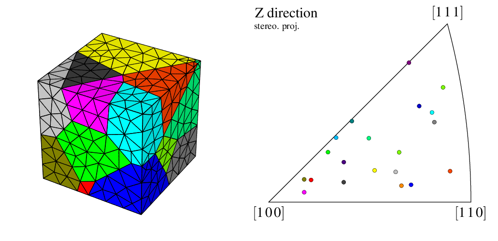
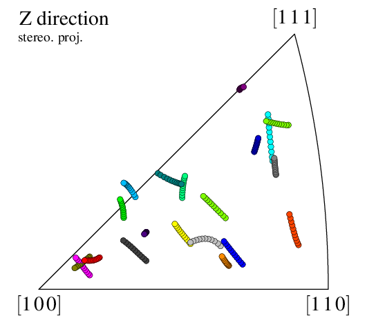

.. _orientation_trajectories:

Plotting Orientation Trajectories
=================================

.. important:: Read first: :ref:`pole_figure`.

Orientation trajectories described in a :ref:`simulation_directory` (whether they apply to (raster) tessellation cells or mesh elsets) can be plotted on a pole figure or an inverse pole figure, using the :ref:`neper_v` and its :option:`-space` :data:`[i]pf` options.  This is done by plotting *several simulation steps* on the same figure, using :option:`-step`.

.. note:: In principle, it is possible to plot orientation trajectories from a list of (unrelated) orientations loaded from a file; however, proper visualization generally requires the orientation *history* (through *steps*), hence the recommended use of a :ref:`simulation_directory`.

In the following, the results of a small FEPX simulation is used (:download:`n20.sim.tgz <orientation_trajectories/n20.sim.tgz>`, derived from `this FEPX example <https://fepx.info/doc/examples.html#uniaxial-control-examples-1-uniaxial>`_), which corresponds to the deformation to 10% (engineering) tensile strain of a 20-grain polycrystal :

.. code-block:: console

  $ neper -S n20.sim

  ========================    N   e   p   e   r    =======================
  Info   : A software package for polycrystal generation and meshing.
  Info   : Version 4.5.1
  Info   : Built with: gsl|muparser|opengjk|openmp|nlopt|libscotch (full)
  Info   : Running on 8 threads.
  Info   : <https://neper.info>
  Info   : Copyright (C) 2003-2022, and GNU GPL'd, by Romain Quey.
  Info   : Loading initialization file `/home/rquey/.neperrc'...
  Info   : ---------------------------------------------------------------
  Info   : MODULE  -S loaded with arguments:
  Info   : [ini file] (none)
  Info   : [com line] n20.sim
  Info   : ---------------------------------------------------------------
  Info   : Reading input data...
  Info   :   - Reading arguments...
  Info   :     > Input files: tess msh config
  Info   :     > Node number      : 3606
  Info   :     > Element number   : 2201
  Info   :     > Elset number     : 20
  Info   :     > Partition number : 2
  Info   :     > Step number      : 10
  Info   :     > Node results     : coo
  Info   :     > Elt results      : ori
  Info   :     > Elset results    : ori
  Info   : Elapsed time: 0.001 secs.
  ========================================================================

The polycrystal and its orientations on an IPF can be visualized as follows (the second command appends the two images to generate the image shown below):

.. code-block:: console

  $ neper -V n20.sim -imagesize 500:500 -cameraangle 15 -print img1 -space ipf -print img2
  $ convert +append +repage -flatten img1.png img2.png img3.png

To reproduce *exactly* the images below, add the following line to your :file:`$HOME/.neperrc` file (or to a local configuration file to be loaded with :option:`--rcfile`)::

  neper -V -imagesize 500:500

Generalities
------------

The orientation trajectories can be visualized by specifying several steps to :option:`-step`. Using :option:`-step` :data:`all`, all steps are printed:

.. code-block:: console

  $ neper -V n20.sim -space ipf -step all -print img4

The orientations at successive steps are plotted *on top of each other*, using the same symbols.

.. note:: Orientation trajectories can go out of the standard triangle just as if the inverse pole figure was complete (not reduced to the standard triangle under crystal symmetry conditions).

Configuring the Symbol Plot
---------------------------

The way data are represented can be modified at large, as described in :ref:`pole_figure` (using :data:`elset` instead of :data:`cell`, since the results apply to a mesh).  The :data:`step` variable can also be used to plot orientations differently for each step.  For example, to plot the last orientations using a larger symbol than the others (the "rotation path"):

.. code-block:: console

  $ neper -V n20.sim -space ipf -step all -dataelsetrad "real:((step<10)?0.008:0.024)" -print img5

.. image:: orientation_trajectories/img5.png
