.. _simple_model:

Generating Regular Tessellations
================================

.. note::

  This tutorial presents the :option:`-n`, :option:`-morpho` and :option:`-dim` options of the :ref:`neper_t`. For details on the use of the :ref:`neper_v` in this tutorial, see :ref:`visualize_tessellation`.

  To reproduce *exactly* the images below, add the following line to your :file:`$HOME/.neperrc` file (or to a local configuration file to be loaded with :option:`--rcfile`)::

    neper -V -imagesize 800:400

Regular tessellations are generated using the :ref:`neper_t` and its :option:`-morpho` option.

Specifying the Morphology (:option:`-morpho`)
---------------------------------------------

The morphology of the cells can be specified using :option:`-morpho`.  Generally, a parameter that defines the number of cells is also passed to the option (rather than via :option:`-n`). A tessellation containing :math:`4 \times 4 \times 4` cubic cells can be generated as follows:

.. code-block:: console

  $ neper -T -morpho "cube(4)" -o cube4

This produces a :ref:`tess_file` named :file:`cube4.tess`.

The tessellation can be visualized using the :ref:`neper_v`:

.. code-block:: console

  $ neper -V cube4.tess -print img1

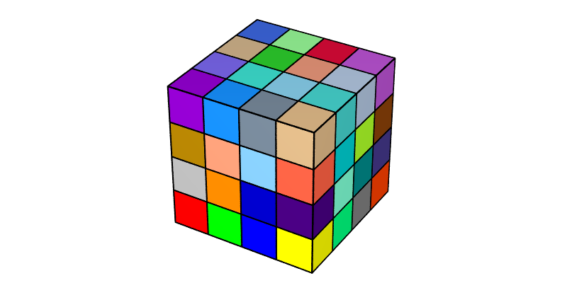

A tessellation containing truncated octahedra can be generated as follows:

.. code-block:: console

  $ neper -T -morpho "tocta(4)" -o tocta4

The tessellation can be visualized with some cells hidden to better highlight the cell morphology:

.. code-block:: console

  $ neper -V tocta4.tess -showcell "z<0.75" -showedge "cell_shown||domtype==1" -print img2

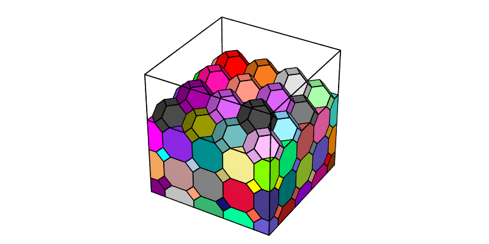

Switching to 2D (:option:`-morpho`)
-----------------------------------

In 2D, squares and regular hexagons can be generated. A tessellation containing :math:`4 \times 4` square cells can be generated as follows:

.. code-block:: console

  $ neper -T -morpho "square(4)" -dim 2 -o square4

The tessellation can be visualized as follows:

.. code-block:: console

  $ neper -V square4.tess -print img3

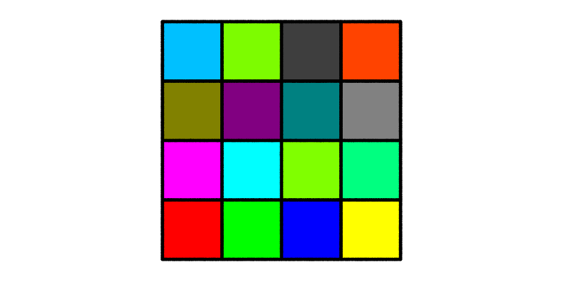

A tessellation containing hexagons can be generated as follows:

.. code-block:: console

  $ neper -T -morpho "hex(4)" -dim 2 -o hex4

The tessellation can be visualized as follows:

.. code-block:: console

  $ neper -V hex4.tess -print img4

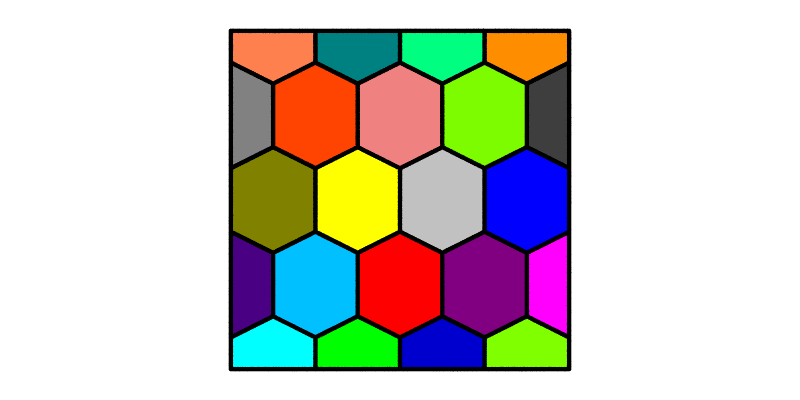

However, because the domain has a unit size, the generated hexagons are not regular hexagons. To obtain regular hexagons, a domain with a :math:`1:\sqrt{3}/2` aspect ratio must be used:

.. code-block:: console

  $ neper -T -morpho "hex(4)" -dim 2 -domain "square(1,sqrt(3)/2)" -o hex4

The tessellation can be visualized as follows:

.. code-block:: console

  $ neper -V hex4.tess -print img5

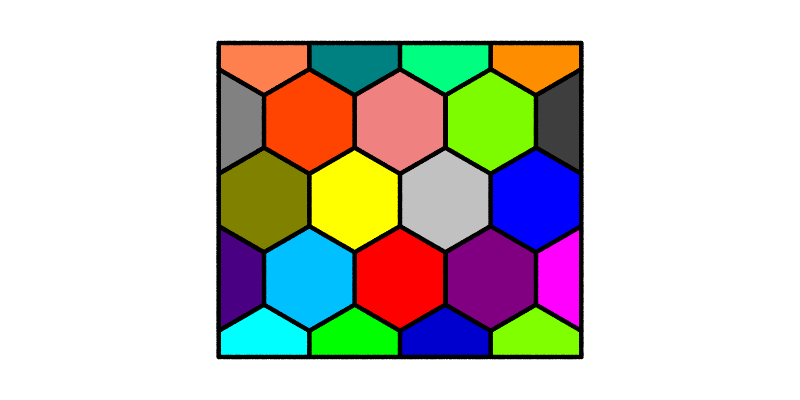

Instead of the default pointy-top (or "vertical") hexagons, flat-top (or "horizontal") hexagons can be obtained by using :option:`-morpho` :data:`hexh`. In this case, a domain with a :math:`\sqrt{3}/2:1` aspect ratio must be used to obtain regular hexagons:

.. code-block:: console

  $ neper -T -morpho "hexh(4)" -dim 2 -domain "square(sqrt(3)/2,1)" -o hexh4

The tessellation can be visualized as follows:

.. code-block:: console

  $ neper -V hexh4.tess -print img6

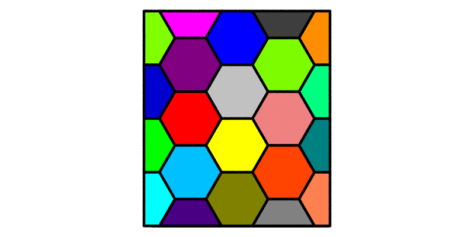

Specifying Different Numbers of Cells along Each Direction (:option:`-morpho`)
------------------------------------------------------------------------------

Different number of cells can be specified along each direction. For example, for cubes:

.. code-block:: console

  $ neper -T -morpho "cube(8,4,4)" -o cube844

The tessellation can be visualized as follows:

.. code-block:: console

  $ neper -V cube844.tess -print img7

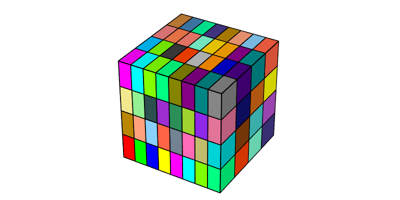

This can also be done in an elongated domain to preserve equiaxed cells:

.. code-block:: console

  $ neper -T -morpho "cube(8,4,4)" -domain "cube(2,1,1)" -o cube448

The tessellation can be visualized as follows:

.. code-block:: console

  $ neper -V cube448.tess -print img8

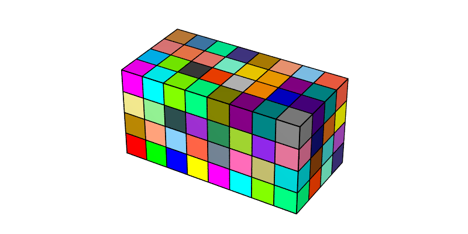

Similarly, for truncated octahedra, squares and hexagons:

.. code-block:: console

  $ neper -T -morpho "tocta(8,4,4)" -domain "cube(2,1,1)" -o tocta448
  $ neper -T -morpho "square(8,4)" -domain "square(2,1)" -dim 2 -o square42
  $ neper -T -morpho "hex(8,4)" -domain "square(2,sqrt(3)/2)" -dim 2 -o hex42

The tessellation can be visualized as follows:

.. code-block:: console

  $ neper -V tocta448.tess -showcell "z<0.75" -showedge "cell_shown||domtype==1" -print img9
  $ neper -V square42.tess -cameraangle 22 -print img10
  $ neper -V hex42.tess -cameraangle 22 -print img11

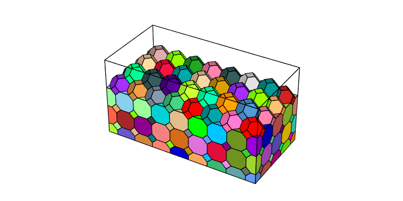

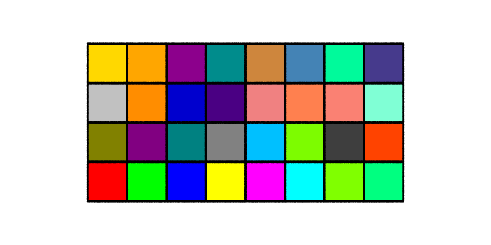

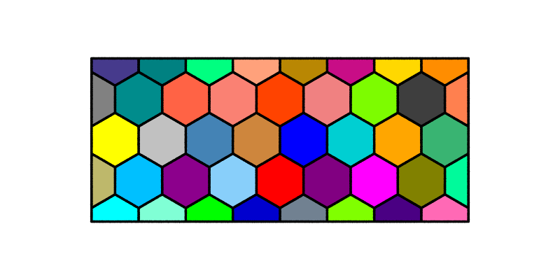
