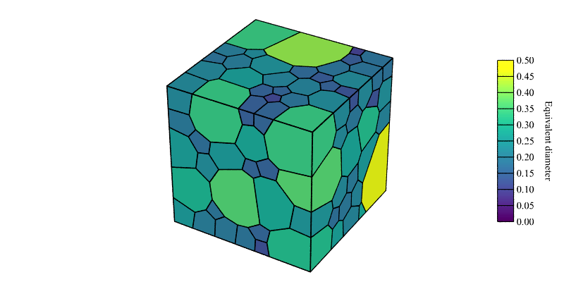

.. _visualize_tessellation:

Visualizing a Tessellation
==========================

A tessellation can be visualized using the :ref:`neper_v`.  The entities to show can be specified, so as their size, transparency and other properties.  The crystals can also be visualized.  Advanced visualizations can be realized.

A simple tessellation is used in this tutorial, which is generated using the command

.. code-block:: console

  $ neper -T -n 200 -morpho gg -oricrysym cubic -o n200

.. note::

  To reproduce *exactly* the images below, add the following line to your :file:`$HOME/.neperrc` file (or to a local configuration file to be loaded with :option:`--rcfile`)::

    neper -V -imagesize 800:400

Generating a Tessellation Image
-------------------------------

The tessellation can be visualized as follows:

.. code-block:: console

  $ neper -V n200.tess -print img1

.. image:: visualize_tessellation/img1.png

This generates a PNG image named :file:`img1.png`.  By default, all cells and edges are shown, while other entities are hidden.  Cells are colored from their ids and edges appear in black.

Showing Specific Entities
-------------------------

The entities to show can be specified using options :option:`-show*`, using any logical expression based on the :ref:`tessellation_keys` as arguments.  For instance, only some of the cells can be shown:

.. code-block:: console

  $ neper -V n200.tess -showcell "z<0.5" -print img2

.. image:: visualize_tessellation/img2.png

By default, only edges that belong to a shown cell are plotted. However, the edges to show can also be specified.  For example, to show all of them:

.. code-block:: console

  $ neper -V n200.tess -showcell "z<0.5" -showedge all -print img3

.. image:: visualize_tessellation/img3.png

The figure is not very clear, and only the domain edges can be added instead:

.. code-block:: console

  $ neper -V n200.tess -showcell "z<0.5" -showedge "cell_shown||domtype==1" -print img4

.. image:: visualize_tessellation/img4.png

:data:`cell_shown` (or :data:`cell_shown==1`) selects edges for which at least one cell is shown, :data:`domtype==1` selects edges that belong to a domain edge, and :data:`||` is the logical :code:`OR`.

A logical expression can be arbitrarily complex.  For example, the following command only shows the cells that have a volume larger than average (0.005, for a 200-cell in a unit cube), have at least 20 faces and are interior to the domain:

.. code-block:: console

  $ neper -V n200.tess -showcell "(vol>0.005)&&(facenb>=20)&&(body>0)" -showedge "cell_shown||domtype==1" -print img5

.. image:: visualize_tessellation/img5.png

It is also possible to fully hide the cells and visualize the tessellation based on the individual faces, edges, etc.:

.. code-block:: console

  $ neper -V n200.tess -showcell none -showface "z<0.5" -showedge "face_shown||domtype==1" -print img6

.. image:: visualize_tessellation/img6.png

Faces appear in white by default, but can be assigned colored, as will be covered in the following.

The vertices can also be shown (as before, the domain edges are shown):

.. code-block:: console

  $ neper -V n200.tess -showcell none -showedge "domtype==1" -showver all -print img7

.. image:: visualize_tessellation/img7.png

Finally, the crystals can be shown (as before, the domain edges are shown):

.. code-block:: console

  $ neper -V n200.tess -showcell none -showcrystal all -showedge "domtype==1" -print img8

.. image:: visualize_tessellation/img8.png

By default, crystals are represented based on the cell crystal symmetry (as specified by option :option:`-oricrysym`), the cell size and the crystal orientations.

Setting Color, Transparency, Size, etc.
---------------------------------------

The way entities are represented can be specified using options :option:`-data*`.  The entities of a tessellation are the cells (which correspond to polyhedra in 3D and faces in 2D), polyhedra, faces, edges, vertices, seeds and crystals, and their properties include
the color (options :option:`-data<entity>col`, :option:`-data<entity>colscheme` and :option:`-data<entity>scale` and :option:`-data<entity>scaletitle`),
transparency (option :option:`-data<entity>trs`) and radius (or size) (option :option:`-data<entity>rad`).
Similarly to the :option:`-show*` options, the :option:`-data*` options can take (mathematical) expressions as argument.

Coloring Cells by Orientations
~~~~~~~~~~~~~~~~~~~~~~~~~~~~~~

The following command colors cells by orientation:

.. code-block:: console

  $ neper -V n200.tess -datacellcol ori -print img9

.. image:: visualize_tessellation/img9.png

.. note:: The orientation color key itself is not generated but can be obtained as detailed in :ref:`orientation_color_key` (:ref:`rodrigues_color_key`).

The color scheme can be changed to IPF as follows:

.. code-block:: console

  $ neper -V n200.tess -datacellcol ori -datacellcolscheme ipf -print img10

.. image:: visualize_tessellation/img10.png

.. note:: The orientation color key itself is not generated but can be obtained as detailed in :ref:`orientation_color_key` (:ref:`ipf_color_key`).

Coloring Entities from Integer Values
~~~~~~~~~~~~~~~~~~~~~~~~~~~~~~~~~~~~~

Just like the cell id (:data:`id`) is used to color cells by default, different integer values can be used, for example the number of faces:

.. code-block:: console

  $ neper -V n200.tess -datacellcol int:facenb -print img11

.. image:: visualize_tessellation/img11.png

The different integer values are assigned colors using a color palette (see :ref:`color_map_for_integer_values`).

(Mathematical) expressions can be used.  For example, Euler's polyhedron formula, :math:`V - E + F = 2`, where :math:`V`, :math:`E` and :math:`F` are the number of vertices, edges and faces of a cell, respectively, can be verified as follows:

.. code-block:: console

  $ neper -V n200.tess -datacellcol int:vernb-edgenb+facenb -print img12

.. image:: visualize_tessellation/img12.png

All cells are green, which represents effectively a value of 2 according to the color palette (see :ref:`color_map_for_integer_values`).

Other entities can be colored in the same way.  For example, to color the vertices from their cell numbers:

.. code-block:: console

  $ neper -V n200.tess -datavercol int:cellnb -dataverrad 0.02 -showcell "z<0.5" -showedge "cell_shown||domtype==1" -showver cell_shown -print img13

.. image:: visualize_tessellation/img13.png

The image shows the vertices having 1, 2, 3 and 4 cells in red, green, blue and yellow, respectively.

.. note:: In options :option:`-data*col`, the data type may be omitted if it can be determined from the data value, as in :data:`-datavercol cellnb`.

Coloring Entities from Real Values
~~~~~~~~~~~~~~~~~~~~~~~~~~~~~~~~~~

Cells can be colored from real values, for example from the cell equivalent diameters:

.. code-block:: console

  $ neper -V n200.tess -datacellcol real:diameq -datacellscale 0.00:0.50 -datacellscaletitle "Equivalent diameter" -print img14
  $ convert img14.png img14-scale3.png -gravity East -composite img14.png

.. image:: visualize_tessellation/img14.png

This originally produces a PNG file named :file:`img14.png` for the map and a PNG file named :file:`img14-scale.png` for the scale bar, which is included to :file:`img14.png` thanks to :program:`convert`.

Again, mathematical expressions can be used:

.. code-block:: console

  $ neper -V n200.tess -datacellcol "real:x*sqrt(y)*sqrt(z)" -datacellscale 0.00:1.00 -datacellscaletitle "x*sqrt(y)*sqrt(z)" -print img15
  $ convert img15.png img15-scale3.png -gravity East -composite img15.png

.. image:: visualize_tessellation/img15.png

The color key (see :ref:`color_map_for_real_values`) can be changed using option :option:`-datacellcolscheme`:

.. code-block:: console

  $ neper -V n200.tess -datacellcol "real:x*sqrt(y)*sqrt(z)" -datacellscale 0.00:1.00 -datacellscaletitle "x*sqrt(y)*sqrt(z)" -datacellcolscheme heat -print img16
  $ convert img16.png img16-scale3.png -gravity East -composite img16.png

.. image:: visualize_tessellation/img16.png

Not only cells can be colored.  For example, to color the edges from their lengths:

.. code-block:: console

  $ neper -V n200.tess -datacellcol lightgray -dataedgecol length -dataedgescaletitle "length" -dataedgescale 0.00:0.30 -print img17
  $ convert img17.png img17-scale1.png -gravity East -composite img17.png

.. image:: visualize_tessellation/img17.png

Crystals can be colored, for example, from the cell equivalent diameters:

.. code-block:: console

  $ neper -V n200.tess -showcell none -showcrystal all -datacrystalcol real:diameq -datacrystalscale 0.00:0.50 -datacrystalscaletitle "Equivalent diameter" -showedge "domtype==1" -print img18
  $ convert img18.png img18-scalec.png -gravity East -composite img18.png

.. image:: visualize_tessellation/img18.png

Making Entities Transparent
~~~~~~~~~~~~~~~~~~~~~~~~~~~

The transparency level of entities can be specified using options :option:`-data<entity>trs`.  The transparency ranges from :data:`0` (fully opaque) to :data:`1` (fully transparent).  The example below uses semi-transparency to show the tessellation interior:

.. code-block:: console

  $ neper -V n200.tess -datacelltrs 0.5 -print img19

.. image:: visualize_tessellation/img19.png

Again, this works for all entities.  For example, to show all interior faces colored from their surface areas:

.. code-block:: console

  $ neper -V n200.tess -showcell none -showface "domtype==-1" -showedge face_shown -datafacecol area -datafacetrs 0.5 -datafacescale 0.00:0.01:0.02:0.03:0.04:0.05 -datafacescaletitle "Surface area" -print img20
  $ convert img20.png img20-scale2.png -gravity East -composite img20.png

.. image:: visualize_tessellation/img20.png

Changing the Entity Radius
~~~~~~~~~~~~~~~~~~~~~~~~~~

The radius of entities can by modified using options :option:`-data<entity>rad`, and this works for vertices, edges, seeds and crystals.  For example, to plot thick (and colored) edges:

.. code-block:: console

  $ neper -V n200.tess -dataedgerad 0.05 -dataedgecol id -print img21

.. image:: visualize_tessellation/img21.png

The following command plots small crystals in a tessellation for which cells are made gradually transparent:

.. code-block:: console

  $ neper -V n200.tess -showcrystal all -datacrystalrad 0.5*radeq -datacelltrs "sqrt(z)" -dataedgetrs 0.75 -print img22

.. image:: visualize_tessellation/img22.png

Changing the General Settings
~~~~~~~~~~~~~~~~~~~~~~~~~~~~~

Neper uses POV-Ray, a ray-tracing software, to generate the PNG images.  As such, properties such as the camera position, angle, etc., the type of projection, shadowing effects, etc. can be set.

Camera Settings
^^^^^^^^^^^^^^^

The camera position can be changed using option :option:`-cameracoo`, for example to produce orthogonal views - option :option:`-camerasky` may also be needed, to define the vertical direction, and option :option:`-cameraangle` sets the opening angle along the horizontal direction:

.. code-block:: console

  $ neper -V n200.tess -datacelltrs 0.5 -cameraangle 12 -imagesize 400:400 -print view -cameracoo 7:y:z -camerasky 0:1:0 -print xview -cameracoo x:7:z -camerasky 0:0:1 -print yview -cameracoo x:y:7 -camerasky 1:0:0 -print zview
  $ convert +append view.png xview.png tmp1.png
  $ convert +append yview.png zview.png tmp2.png
  $ convert -append tmp1.png tmp2.png img23.png

.. image:: visualize_tessellation/img23.png

.. note:: Several images can be generated in a single Neper command by using option :option:`-print` several times.

The camera projection type can be specified using option :option:`-cameraprojection` - in 3D, the default is :data:`perspective`, but :data:`orthographic` is also available:

.. code-block:: console

  $ neper -V n200.tess -cameraprojection orthographic -print img24

.. image:: visualize_tessellation/img24.png

The orthographic projection keeps parallel lines parallel.

Scene Settings
^^^^^^^^^^^^^^

Shadowing can be turned on or off using option :option:`-showshadow`:

.. code-block:: console

  $ neper -V n200.tess -datacellcol real:diameq -datacellscale 0.00:0.50 -datacellscaletitle "Equivalent diameter" -sceneshadow 0 -print img25
  $ convert img25.png img25-scale3.png -gravity East -composite img25.png

While shadowing generally improves visualization, turning it off may be useful to render "true" colors, which closely match a color key.  Shadowing not only generates shadows between objects, but also affects the color of objects depending on their orientation with respect to the light source.

The background color of the scene can be specified using option :option:`-scenebackground` (see :ref:`colors`):

.. code-block:: console

  $ neper -V n200.tess -scenebackground 41:128:185 -print img26

.. image:: visualize_tessellation/img26.png

Finally, the image size (in pixels) can be specified using option :option:`-imagesize`:

.. code-block:: console

  $ neper -V n200.tess -imagesize 200:100 -scenebackground 41:128:185 -print img27

.. image:: visualize_tessellation/img27.png
