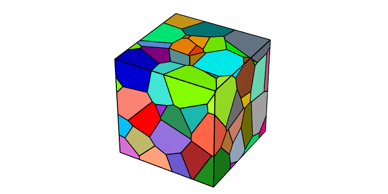
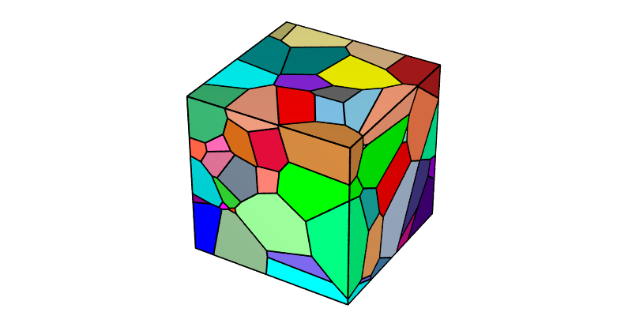
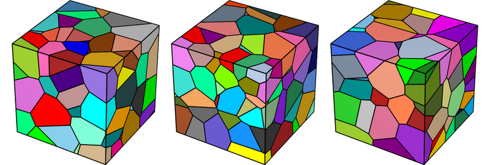
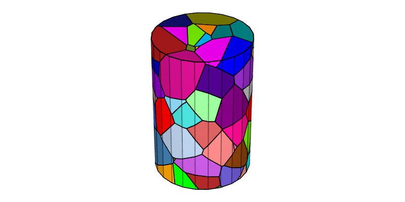
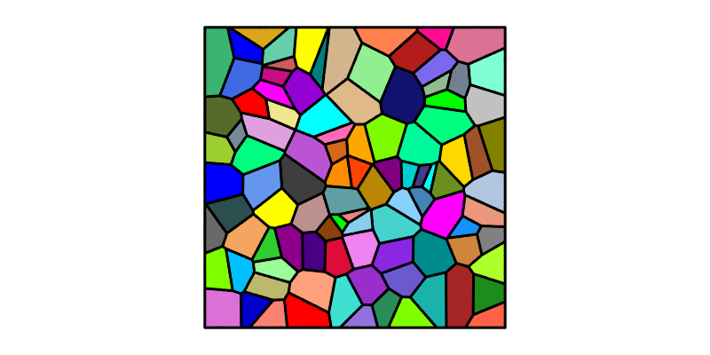

.. _simple_model:

Generating a Voronoi Tessellation
=================================

.. note::

  This tutorial presents the :option:`-n`, :option:`-id`, :option:`-dim` and :option:`-domain` options of the :ref:`neper_t`. For details on the use of the :ref:`neper_v` in this tutorial, see :ref:`visualize_tessellation`.

  To reproduce *exactly* the images below, add the following line to your :file:`$HOME/.neperrc` file (or to a local configuration file to be loaded with :option:`--rcfile`)::

    neper -V -imagesize 800:400

Tessellations are generated using the :ref:`neper_t`.  Voronoi tessellations are generated by default [CMAME2011]_, and the only required input is the number of cells.

Specifying the Number of Cells (:option:`-n`)
---------------------------------------------

The number of cells can be specified using :option:`-n`.  A Voronoi tessellation containing 100 cells can be generated as follows:

.. code-block:: console

  $ neper -T -n 100

This produces a :ref:`tess_file` named :file:`n100-id1.tess`.

The tessellation can be visualized using the :ref:`neper_v`:

.. code-block:: console

  $ neper -V n100-id1.tess -print img1

This produces a PNG file named :file:`img1.png` where cells are colored by their ids (1, 2, etc.) according to the :ref:`color_map_for_integer_values`.

Generating Different Tessellations (:option:`-id`)
--------------------------------------------------

Given a number of cells, different tessellations can be obtained using :option:`-id` (the default value is :data:`1`).  The specified value initializes the random number generator, which is then used to determine the seed coordinates.  This can be done as follows:

.. code-block:: console

  $ neper -T -n 100 -id 2

This produces a :ref:`tess_file` named :file:`n100-id2.tess`.

The new tessellation can be visualized as before:

.. code-block:: console

  $ neper -V n100-id2.tess -print img1b

Those who prefer non-deterministic tessellation generation can use :option:`-id` :data:`-1`, which selects a new random seed on each run. For example, to generate three different tessellations:

.. code-block:: console

  $ neper -T -n 100 -id -1 -o tess1
  $ neper -T -n 100 -id -1 -o tess2
  $ neper -T -n 100 -id -1 -o tess3

The new tessellations can be visualized as before, using ImageMagick's :command:`convert` to assemble the images:

.. code-block:: console

  $ neper -V tess1.tess -print img1c
  $ neper -V tess2.tess -print img1d
  $ neper -V tess3.tess -print img1e
  $ convert img1c.png img1d.png img1e.png -trim +repage -resize x300 -extent x300 -bordercolor white -border 10x0 +append -resize 780x -background white -gravity center -extent 800x img1f.png

Note that, because the generation is non-deterministic, you (or anyone else) won't be able to exactly reproduce these images.

.. .. note :: :option:`-n` and :option:`-id` apply to most types of tessellations, not only Voronoi tessellations.  For regular tessellations with regular cell shapes (e.g. cubes), :option:`-id` does not affect the grain shapes, but it does change their relative locations and crystal orientations.

Defining the Domain (:option:`-domain`)
---------------------------------------

The domain can be defined using :option:`-domain` (the default value is :data:`"cube(1,1,1)"` in 3D and :data:`"square(1,1)"` in 2D). For example, a cylindrical domain of height 1.5 and diameter 1 can be obtained as follows:

.. code-block:: console

  $ neper -T -n 100 -domain "cylinder(1.5,1)"

This produces a :ref:`tess_file` named :file:`n100-id1.tess`.

The tessellation can be visualized as follows, with semi-transparent edges emphasizing the faceted representation of the domain:

.. code-block:: console

  $ neper -V n100-id1.tess -dataedgetrs "((cyl!=1)?0:0.6)" -print img2

.. note :: Complex domains can be generated using :option:`-domain` together with :option:`-transform` :data:`cut`.

Switching to 2D (:option:`-dim`)
--------------------------------

The tessellation dimension can be specified using :option:`-dim` (the default value is :data:`3`). A 2D tessellation can be generated as follows:

.. code-block:: console

  $ neper -T -n 100 -dim 2

This produces a :ref:`tess_file` named :file:`n100-id1.tess`.

The tessellation can be visualized as before:

.. code-block:: console

  $ neper -V n100-id1.tess -print img3

.. [CMAME2011] :ref:`px`.
