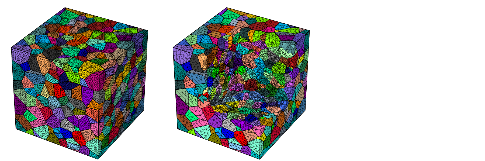
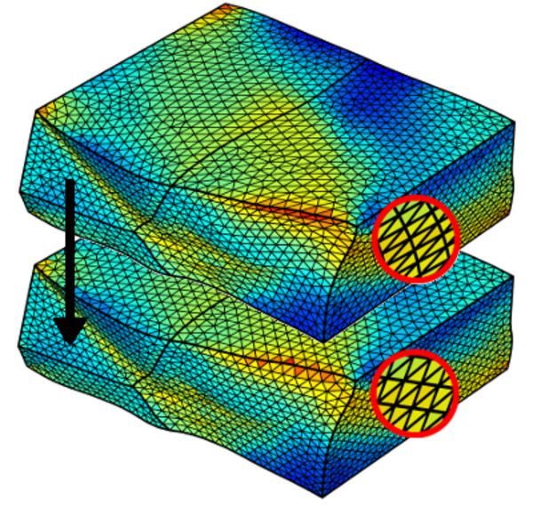
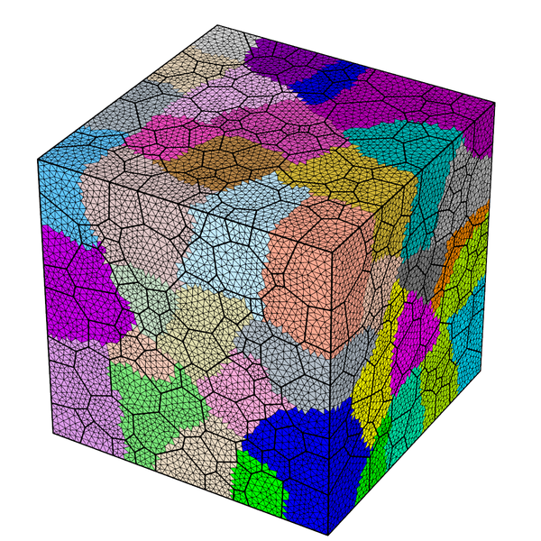
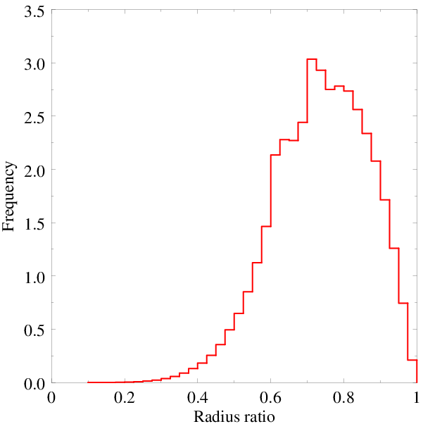

# Meshing

Module -M is dedicated to meshing. The input data is a tessellation as provided by module -T or a mesh to remesh.  The mesh size can be uniform or defined on a per-grain basis. Cohesive elements can be inserted at interfaces. The output mesh can be written at several formats, including the native '.msh', the Abaqus '.inp' and the Zset '.geof'.  Statistical data also are available.

## Generalities

A mesh is created from a tessellation and a target element size. To ensure mesh quality, each face or volume is meshed using several algorithms, until a minimum mesh quality index is reached. The quality index depends on the sizes and aspect ratios of the elements.  The Netgen and Gmsh libraries are used for 2D and 3D meshings. The output data consists of the mesh of the full tessellation, including element sets of the individual cells (optionally interfaces) and node sets of the domain surfaces, edges and vertices. Two meshes of a regularized 1000-cell tessellation are shown below, one comprise of tetrahedral elements and one comprised of (regular) hexahedral elements.

```bash
neper -M n1000.tess
neper -M n1000.tess -elttype hex
```


  [mesh_gene.sh](imgs/mesh_gene.sh)

## Element size

  The element size can be uniform or defined on a per-cell basis. It can be controlled using logical expressions that define cell sets, each of which is assigned a specific element size, or by loading the cell element sizes from a file. Typically, this can be used to generate a mesh with different element sizes for the boundary cells and the interior cells.  Meshes with uniform and per-cell defined element sizes are shown below.

  ```bash
  neper -M n1000.tess -rcl 0.5
  neper -M n1000.tess -rcl "body>0?0.35:1"
  ```

  

  [mesh_size.sh](imgs/mesh_size.sh)

## Remeshing

  Instead of a tessellation, a mesh can be provided as input. The new mesh can be created with the same or different element size, or even with different values along the three dimensions of space.  Moreover, data can be transported from the input mesh to the output mesh. This enables to deform a tessellation to larger strains than is possible with a single mesh. Remeshing and element data transport are illustrated below (top: deformed mesh and bottom: remeshed mesh; an element scalar field is shown in color).

  

## Mesh partitioning

  A mesh can be partitioned for parallel finite element simulations.  The principle is that the partitions are of the same size and the interfaces between them are minimized. Node and element partitions are provided.  The libScotch library is used for partitioning.  A meshed divided into 8 x 8 partitions is shown below.

  ```bash
  neper -M n1000.tess -rcl 0.5 -part 8:8
  ```

  

## Raster tessellation meshing

  2D raster tessellations can be meshed into triangles.  All capabilities available for scalar tessellations are also available for raster tessellations. An example of meshing of a polycrystal with curved grain boundaries (grain growth simulation) is provided below. (Left: raster microstructure; right: corresponding mesh.)

  ```bash
  neper -M micro.tesr
  ```


  

## Statistics

  A wide array of statistics are available for the elements, element sets (at all dimensions) and nodes, including morphology and topology properties. For example, the element variables include: the centroid coordinates, the elset identifier, the partition, the volume and radius ratio, etc. An example of statistical analysis is illustrated below by the distribution of the element radius ratios of a 1000-cell tessellation mesh.

  ```bash
  neper -M n1000.tess -statelt rr
  ```

  

  [mesh_stat.sh](imgs/mesh_stat.sh)
