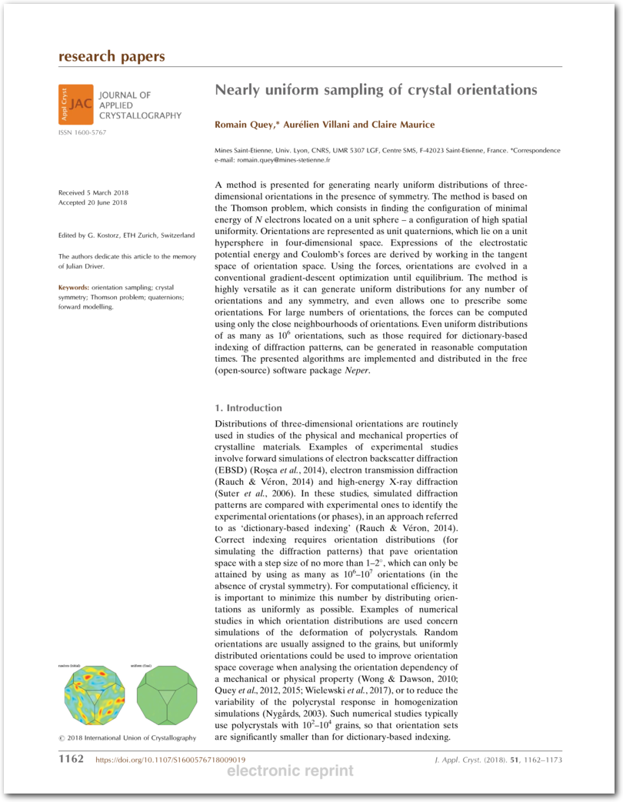
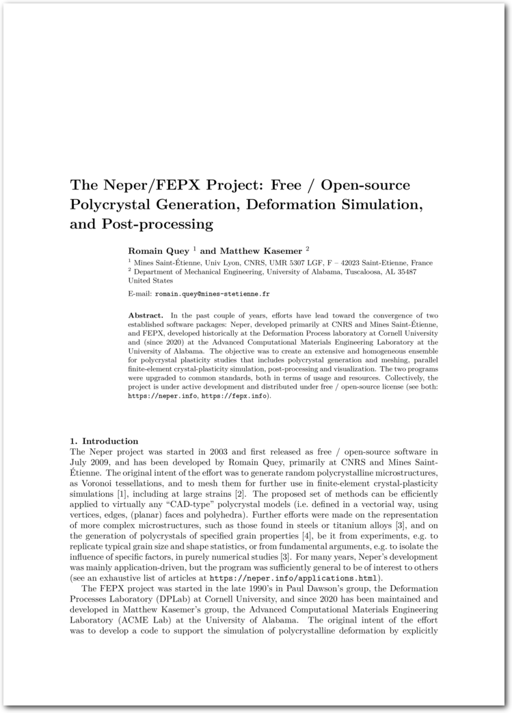

.. _papers:

Reference Papers
================

The methods implemented in Neper are documented in these theory papers (click the image to download):

.. _px:

.. figure:: imgs/paper-px-shadow.png
   :width: 50%
   :align: center
   :target: neper-reference-paper.pdf

   R Quey, PR Dawson and F Barbe, *Large-scale 3D random polycrystals for the finite element method: Generation, meshing and remeshing*, **Computer Methods in Applied Mechanics and Engineering**, vol. 200, pp.  1729-1745, 2011.

.. _singlescale:

.. figure:: imgs/paper-singlescale-shadow.png
   :width: 50%
   :align: center
   :target: https://hal.archives-ouvertes.fr/hal-01626440

   R Quey and L Renversade, *Optimal polyhedral description of 3D polycrystals: method and application to statistical and synchrotron X-ray diffraction data*, **Computer Methods in Applied Mechanics and Engineering**, vol. 330, pp. 308-333, 2018.

.. _flatori:

   R Quey, A Villani and C Maurice, *Nearly uniform sampling of crystal orientations*, **Journal of Applied Crystallography**, vol. 51, pp. 1162-1173, 2018.

The Neper/FEPX project is brefly presented in this conference paper (click the image to download):

.. _riso2022:

   R Quey and M Kasemer, *The Neper/FEPX project:  free / open-source polycrystal generation, deformation simulation, and post-processing*, **IOP Conference Series Materials Science and Engineering**, vol. 1249, pp. 012021, 2022.
