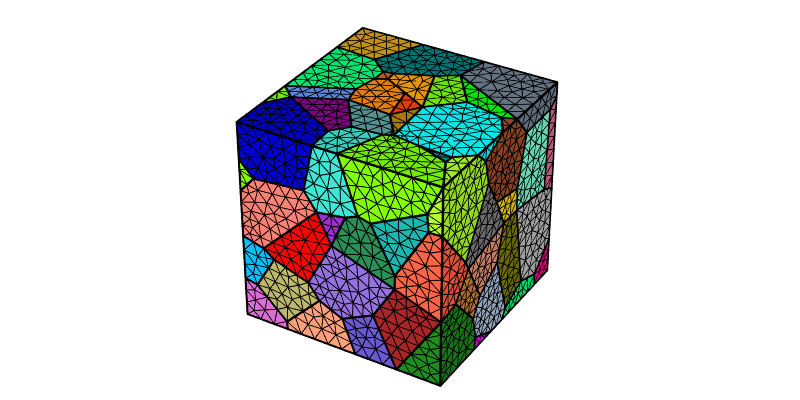

.. _simple_model:

Generating and Meshing a Simple Tessellation
============================================

The only necessary input to generate and mesh a simple tessellation is the number of cells.  By default, a 3D Voronoi tessellation is generated [CMAME2011]_.  2D is also available (option :option:`-dim`).

.. note::

  To reproduce *exactly* the images below, add the following line to your :file:`$HOME/.neperrc` file (or to a local configuration file to be loaded with :option:`--rcfile`)::

    neper -V -imagesize 800:400

Generating a Tessellation
-------------------------

The number of cells can be specified using option :option:`-n` of the :ref:`neper_t`.
A 100-cell tessellation can be generated as follows:

.. code-block:: console

  $ neper -T -n 100

This produces a :ref:`tess_file` named :file:`n100-id1.tess`.

The tessellation can be visualized using the :ref:`neper_v`:

.. code-block:: console

  $ neper -V n100-id1.tess -print img1

This produces a PNG file named :file:`img1.png` where cells are colored arbitrarily from the ids.

.. image:: img1.png

Another tessellation with the same number of cells but different cell properties can be generated using :option:`-id` (the default value is :data:`1`):

.. code-block:: console

  $ neper -T -n 100 -id 2

This produces a :ref:`tess_file` named :file:`n100-id2.tess`.

The tessellation can be visualized as before:

.. code-block:: console

  $ neper -V n100-id2.tess -print img1b

.. image:: img1b.png

Meshing a Tessellation
----------------------

A mesh can be obtained by passing :file:`n100-id1.tess` to the :ref:`neper_m`:

.. code-block:: console

  $ neper -M n100-id1.tess

This produces a :ref:`mesh_file` named :file:`n100-id1.msh`.

The mesh can be visualized using the :ref:`neper_v`:

.. code-block:: console

  $ neper -V n100-id1.tess,n100-id1.msh -print img2

.. note::

  When both the tess file and mesh file are available, it is a good practice to pass both of them to :option:`-V` by using the :data:`,` separator.  Only the mesh is printed.

.. image:: img2.png

The cell boundaries can be highlighted via the 1D elements, using :option:`-showelt1d` and :option:`-dataelt1drad`:

.. code-block:: console

  $ neper -V n100-id1.tess,n100-id1.msh -showelt1d all -dataelt1drad 0.005 -print img3

.. image:: img3.png

Regularizing a Tessellation
---------------------------

It is clear from the above image that the mesh is overrefined at some locations, which is where *small edges* typical of Voronoi tessellations are.  Neper includes *regularization* (option :option:`-regularization`), which removes the smallest edges of the tessellation [CMAME2011]_:

.. code-block:: console

  $ neper -T -n 100 -reg 1
  $ neper -V n100-id1.tess -print img4

.. note:: An option name may be abbreviated as long as the abbreviation is not ambiguous.  Specifically, :data:`-regularization` can be abbreviated to :data:`-reg`.

.. image:: img4.png

The resulting tessellation is very similar to the original one, as only slight morphological changes occur during regularization.  However, no local mesh overrefinements will be present anymore.

The new tessellation can be meshed, and the mesh can be visualized as before:

.. code-block:: console

  $ neper -M n100-id1.tess
  $ neper -V n100-id1.tess,n100-id1.msh -showelt1d all -dataelt1drad 0.005 -print img5

.. image:: img5.png

Setting Mesh Properties
-----------------------

Mesh properties can be specified, such as the element size or *characteristic length*, the element type, etc.

For example, smaller elements than shown above can be obtained using option :option:`-rcl`, and 2nd-order elements can be obtained using option :option:`-order`:

.. code-block:: console

    $ neper -M n100-id1.tess -rcl 0.7 -order 2
    $ neper -V n100-id1.tess,n100-id1.msh -showelt1d all -dataelt1drad 0.005 -print img6

This mesh can be used by `FEPX <https://fepx.info>`_.

.. [CMAME2011] :ref:`px`.
