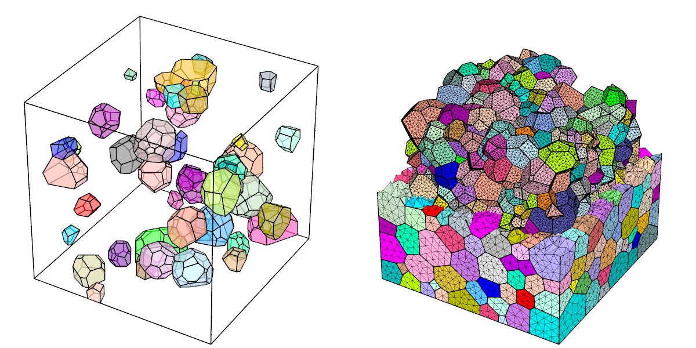

# Visualization

Module -V is dedicated to tessellation, mesh and result visualization. The input data is a tessellation or mesh as provided by modules -T and -M, or a simulation directory as provided by module -S. How the tessellation, mesh and simulation results are displayed can be specified in detail. Mesh slicing is also available.  The output can be a publication-quality PNG image or a VTK file, for interactive visualization.  Loops can also be created to generate a series of images that can then be turned into a movie.

## Generalities

A typical use is to load a tessellation or mesh for visualization and coloring the cells or element sets using a specific palette. It is possible to adjust the scene settings, namely, the camera position, angle, look-at point and projection, shadowing effects and image properties. The POV-Ray ray-tracing package is used to generate images at the PNG format. Examples are provided below for a tessellation and its mesh.

```bash
neper -V n1000.tess               \
         -datacellcol id          \
         -print n1000
neper -V n1000.tess,n1000.msh     \
         -showelt1d all           \
         -dataelset3dcol id       \
         -dataelt3dedgerad 0.001  \
         -dataelt1drad 0.0025     \
         -print n1000-mesh
```


[visu_gene.sh](visu_gene.sh)

## Colour, transparency, etc.

The tessellation and mesh entities can be assigned specific colors, transparencies or sizes. Mesh nodes can also be applied displacements. For example, cells colors can be defined from the cell identifiers, the lattice orientations or a scalar field, or they can be loaded from a file. A mesh can be colored from element or nodal values. Examples are provided below.

```bash
neper -V n1000.tess                           \
         -datacellcol id                      \
         -datacelltrs 0.5                     \
         -print n1000
neper -V n1000.tess,n1000.msh                 \
         -showelt1d all                        \
         -dataelt3dedgerad 0.001               \
         -dataelt1drad 0.0025                  \
	 -datanodecol "real:file(mesh.stnode)" \
         -dataeltcol from_nodes                \
	 -print n1000-mesh
```


[visu_cotr.sh](visu_cotr.sh)

## Entity selection

For both tessellations and meshes, the types and sets of entities to display can be specified. This can be carried out using logical expressions or identifiers loaded from a file. This is illustrated below for a tessellation and its mesh.

```bash
neper -V n1000.tess                         \
         -datacellcol id                    \
         -datacelltrs 0.5                   \
         -showcell "id<=50"                 \
         -showedge "cell_shown||domtype==1" \
         -print selecttess
neper -V n1000.tess,n1000.msh               \
         -dataelsetcol id                   \
	 -showelt "z<0.5||body>0"           \
         -showelt1d elt3d_shown             \
	 -dataelt3dedgerad 0.001            \
         -dataelt1drad 0.0025               \
	 -print selectmesh
```



[visu_sele.sh](visu_sele.sh)

## Mesh slicing

One or several slices of a mesh can be displayed. All fields are retained during slicing. This is illustrated on the right by 3 orthogonal slices of a mesh, where the color shows the distance with respect to the nearest cell boundary.

```bash
neper -V n1000.tess,n1000.msh                      \
         -dataelt3dedgerad 0.001                   \
         -dataelt1drad 0.0025                      \
         -datanodecol scal:mesh-rclbody0p35.stnode \
	 -dataeltcol from_nodes                    \
	 -slicemesh x=0.5,y=0.5,z=0.5              \
	 -print slicemesh
```


[visu_slic.sh](visu_slic.sh)

## Simulation

Simulation results from a simulation directory can be simply displayed.  The simulation directory can be loaded as input, which effectively loads its input data (tessellation and mesh) and make the simulation results available in a similar way as the internal data of a tessellation or mesh (node coordinates, etc.).  This allows for easy visualization of simulation results, including through time, using -loop.  
